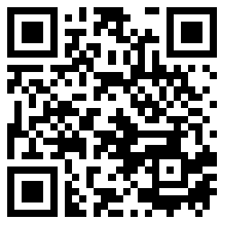

My contacts:

-   Email: [kov4l3nko@gmail.com](mailto:kov4l3nko@gmail.com)
-   Twitter: [@kov4l3nko](https://twitter.com/kov4l3nko)
-   GitHub: [@kov4l3nko](https://github.com/kov4l3nko)
-   LinkedIn: [@kov4l3nko](https://www.linkedin.com/in/kov4l3nko/)

# A quick note on the blog

Please do not take the blog seriously :) Here I share tutorials, talks and researches I did for fun. Most of my commercial researches are private and can't be shared because of agreements with the customers, so I usually do not post serious things to the blog.

---

__Important!__ All header images in the blog are from _free_ photo stocks. Unfortunately, I can't be sure the images are really free for use (sometimes, free photo stocks steal copyrighted images, you know). If you recognise that some of the header images are copyrighted, please contact me, I'll remove the images.

---

# Researches for money

I do researches for money, but there are some rules:

-   no illegal researches;
-   no researches for Iran, Sudan, Syria, North Korea;
-   no researches for Russian Federation, Russians, Russian-backed companies and fans of Putin all around the World;
-   no _security_ researches for China (non-security researches are allowed).

# QR-coded link to this page

