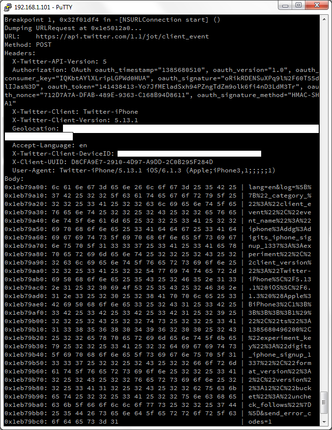

Reversing the official Twitter client 5.13.1 for iOS, I found that it sends some very strange requests to a server. I used a custom GDB script to dump [`[NSURLConnection]`](https://developer.apple.com/library/mac/documentation/Cocoa/Reference/Foundation/Classes/NSURLConnection_Class/Reference/Reference.html) right before it invokes [`[start]`](https://developer.apple.com/library/mac/documentation/Cocoa/Reference/Foundation/Classes/NSURLConnection_Class/Reference/Reference.html#jumpTo_15). It allowed me to see a HTTPS traffic between the Twitter client and server. 

In addition to a usual traffic (registration, authorization, tweeting etc), I often saw POST requests to `https://api.twitter.com/1.1/jot/client_event`. The requests looked like 



The Twitter client sent such requests after almost any action. I started the client? Ok, let's send a request! I tapped the "Sign in" button (did not sign in yet, just tapped the button)? Ok, let's send another request! I was just doing nothing for some time? One more request! I closed the Twitter client? More, more requests!.. I was intrigued by the requests. What do they mean? I played with the Twitter client and analyzed a couple of request dumps. Finally, I found out the common structure of the request: 

```
URL:    https://api.twitter.com/1.1/jot/client_event
Method: POST
Headers:
  X-Twitter-API-Version: 5
  Authorization: OAuth... blah-blah-blah, here is a usual OAuth authorization header signed with a secret key
  X-Twitter-Client: Twitter-iPhone
  X-Twitter-Client-Version: 5.13.1
  Geolocation: the user's location here (if you switch off Location Services, this header will gone)
  Accept-Language: en
  X-Twitter-Client-DeviceID: the ID of user's i-device
  X-Client-UUID: the UUID (it is a random number, it was generated by the Twitter client once on first start;
                 the UUID is the same for all requests)
  User-Agent: Twitter-iPhone/5.13.1 iOS/version here (Apple;iPhone3,1;;;;;1)
Body (it's URL-encoded):
  lang=en&log=...a mistery JSON comes here...&send_error_codes=1
```

Of course, the most interesting part of the request is the "mystery JSON" in the POST body :) It is an array of elements. Every element has the following structure: 

```
[
  ...
  {
   "event_name": the name of the event
   "ts": UNIX timestamp,
   "format_version":2,
   "_category_":"client_event",
   "client_version":"Twitter-iPhone\5.13.1 iOS/version here
                    (Apple;iPhone3,1;;;;;1)"
  }
  ...
]
```

For example, I tapped "Sign in" (I did not actually sign up, just tapped the button) and looked at the dump. The "mystery JSON" was: 

```
[
  {
   "event_name":"iphone:login:::impression",
   "ts":1385678390003,
   "format_version":2,
   "_category_":"client_event",
   "client_version":"Twitter-iPhone\5.13.1 iOS\6.1.3 (Apple;iPhone3,1;;;;;1)"
  }
]
```

It looks like `event_name`, `ts`, `format_version`, `_category_` and `client_version` are mandatory fields. I saw them in all POST requests to `https://api.twitter.com/1.1/jot/client_event`. In addition, some elements of a "mystery JSON" may contain extra fields. For example, I tapped the "Username" input field in the sign in screen of the Twitter client, and saw 

```
[
  {
   "_category_":"client_event",
   "event_name":"iphone:ddg:digits_iphone_signup_1337::experiment",
   "client_version":"Twitter-iPhone\5.13.1 iOS\6.1.3 (Apple;iPhone3,1;;;;;1)",
   "ts":1385678389354,
   "experiment_key":"digits_iphone_signup_1337",
   "format_version":2,
   "version":12,
   "bucket":"uncheck_follows"
   }
]
```

Probably, the extra fields `experiment_key`, `version`, and `bucket` contained additional information about my action. What do the fields mean? I don't know yet.

Well, as far as I see it, the official Twitter client for iOS uses POST requests to `https://api.twitter.com/1.1/jot/client_event` to inform Twitter servers about almost any user's action. Probably, guys from Twitter will say "don't worry, we are just collecting user experience", but in fact they know all about what and (taking into account the `Geolocation` header) when you are doing to the Twitter client, anonymous.

So it goes.