Here is an extremely detailed step-by-step instruction for a jailbroken iPhone 4 with iOS 6.1.x and Cydia installed. It will be useful for beginners, not for advanced reverse engineers.

# Step 1. OpenSSH

First of all, install OpenSSH. On the iPhone, run Cydia and tap "OpenSSH Access How-To":

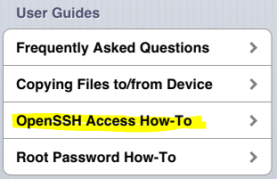

Tap the "OpenSSH" link:

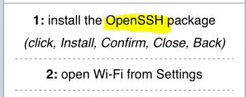

Tap "Install"

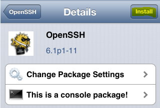

and "Confirm":

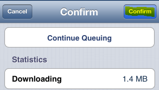

Wait until installation is completed and tap "Return to Cydia":

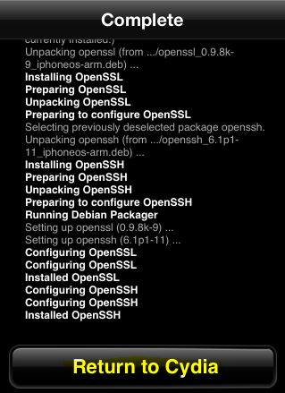

Now OpenSSH is installed. On the iPhone, open "Settings" → "Wi-Fi" and connect the iPhone to a Wi-Fi network (if it is not connected yet). Then tap the blue arrow icon next the Wi-Fi network name  and note the IP address of the iPhone: 

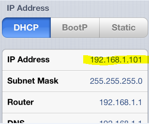

On a PC, connected to the same Wi-Fi network, run your favorite SSH client ([Putty](http://www.chiark.greenend.org.uk/~sgtatham/putty/) or whatever you use) and connect to the IP address you noted above. Use `root` as the login and `alpine` as the password. Enter `passwd` commands in the SSH console to change root and mobile passwords: 

```
iPhone:~ root# passwd
Changing password for root.
New password: <type your new password here>
Retype new password: <retype your new password here>
	
iPhone:~ root# passwd mobile
Changing password for mobile.
New password: <type your new password here>
Retype new password: <retype your new password here>
```

# Step 2. GDB

It's time to install GDB. On the iPhone, run Cydia and tap "Manage" and "Sources":

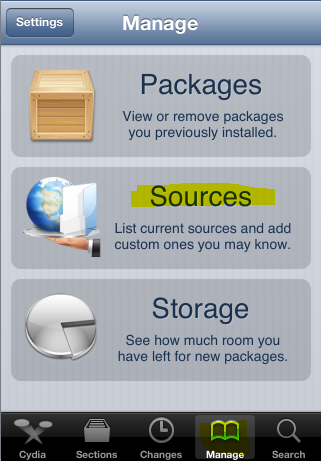

Tap "Edit"

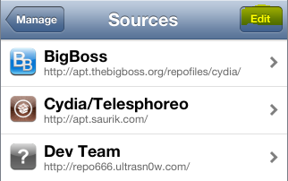

and "Add":

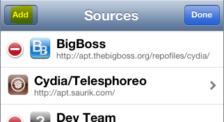

Enter <http://cydia.myrepospace.com/ohmza/> and tap "Add Source" 

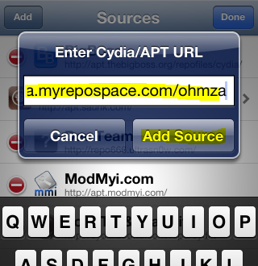

Wait until installation is completed and tap "Return to Cydia": 

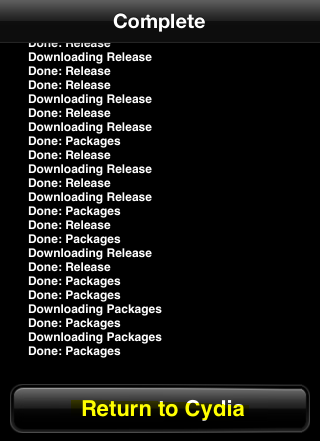 

Tap "Sections", choose "ohmza -myRepoSpace": 

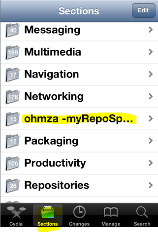 

Tap "GNU Debugger (iOS 5&6)": 

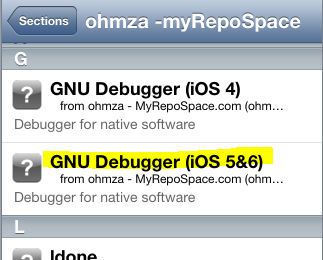 

Then tap "Install" 

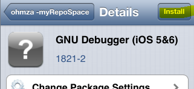

and "Confirm"

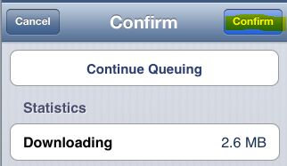

Wait until installation is completed and tap "Return to Cydia": 

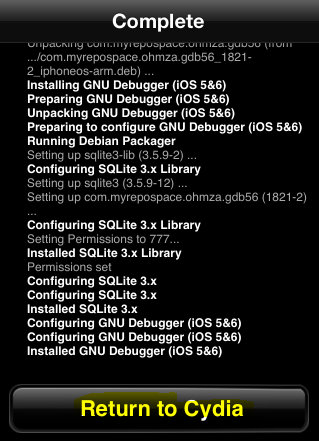

That's it! 

# Step 3. *nix commands

To make well-known *nix commands (e.g. `ps`) working on the iPhone, install the `adv-cmds` package from Cydia. On the iPhone, run Cydia and tap "Sections" and "Administration":

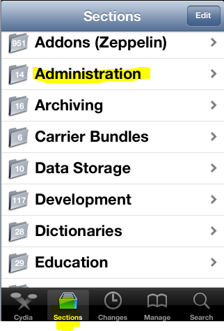

Then tap "adv-cmds"

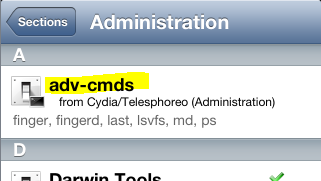

and "Install" 

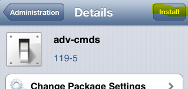 

and, finally, "Confirm" 

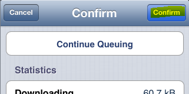 

Wait until installation is completed and tap "Return to Cydia": 

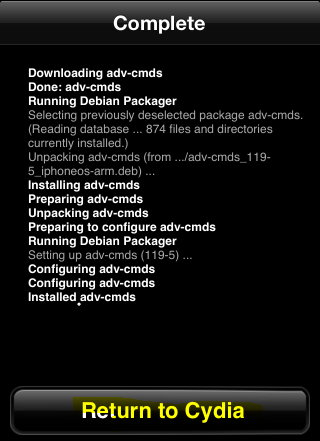 

That's all. All links in the text were alive when posting.