In this post we will discuss user-defined GDB commands on iOS. We will talk about some really simple things and play with "toy" examples. Hovewer, it is assumed that the reader is not a 100% noob. He (or she) should be familiar GDB on iOS and should has basic knowledge of Objective C runtime (all that classes, class instances, properties... well, you know :)).

All examples were tested for GDB 6.3.50-20050815 (Apple version gdb-1821) running on a jailbroken iPhone 4 with iOS 6.1.3. Probably they will work with other versions of GDB and iOS as well. Also, please note that GDB for iOS is not the most stable debugger ever created. So if you are sure that your user-defined command is okay, but it doesn't work, just restart GDB and try again. Sometimes it helps :)

# Hello, World!

Let's start with a simple user-defined command `hello_world`. First we should connect a jailbroken iPhone with our favorite SSH client (I like Putty, so we'll see it on all screenshots in this post :)). Then we should start GDB and attach it to a running process. Now if we type in GDB console

	(gdb) define hello_world

we should see the following prompt:

	Type commands for definition of "hello_world".
	End with a line saying just "end".
	>

It's time to type our first user-defined command:

	> printf "Hello, World!\n"
	> end

It's done! To run the command, we should just type

	(gdb) hello_world

The result of execution will look like

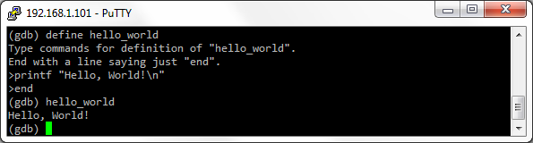

Please note that a name of a user-defined command is not case sensitive. It contains alphabetical characters, digits, `_` and `-`. Spaces and characters like `+*/@#!?$&()=` are forbidden.

# Help for a user-defined command

Ok, we've wrote the `hello_world` command. Now let's document it. If we type in GDB console

	(gdb) document hello_world

we should see the following prompt:

	Type documentation for "hello_world".
	End with a line saying just "end".
	>

Let's type a description of the `hello_world` command, e.g.

	> The hello_world command just prints Hello, World!
	> That's all :)
	> end

To show the help, just type in GDB console:

	(gdb) help hello_world

The result should look like

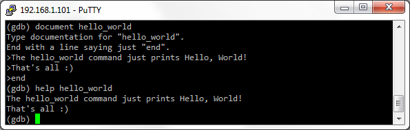

Please note that it is not possible to document an undefined command. If we want to document a user-defined command, we should define it with `define` keyword first.

# Execute a user-defined command from a script file

Now let's put the `hello_world` command to a file and call it as a script. For this purpose, let's open any text editor that can save files in plain text format, and type the commands and comments (comments start with the hash character, `#`, and extend to the end of the line):

	###########################################################################
	# This is just a useless example of
	# a user-defined command in a script
	# file helloworld.gdbs
	###########################################################################
	
	# The command
	
	define hello_world
	printf "Hello, World!\n"
	end
	
	# The help
	
	document hello_world
	The hello_world command just prints Hello, World!
	That's all :)
	end

Save the text to a plain text file named `helloworld.gdbs` in a local folder on PC, then copy the file to any folder on the iPhone, e.g. `/usr/bin/`. To load the `helloworld.gdbs` script, just type in GDB console:

	(gdb) source /usr/bin/helloworld.gdbs

That's it! Now if we try to execute `hello_world` and `help hello_world`, we will see something similar to

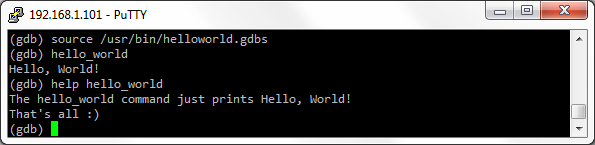

Please note that the the script file name and `.gdbs` extension (**GDB s**cript) was chosen arbitrary. In fact, we could choose any file name and extension, e.g. `hello-world.gdscr` (**GD**B **scr**ipt) or even `hw1234.mcs` (**m**y **c**ool **s**cript :)). Anyway, GDB doesn't care.

Also, please note that the script file should not contain tabs. If we want to use indents to keep code readable, we should use spaces, not tabs:

	# The command

	define hello_world
	  printf "Hello, World!\n"
	end

# Running user-defined commands on breakpoints

It is possible to run a user defined command on a breakpoint as well as any other regular GDB command. Just use `commands`. For example, to run `help hello_world` on a breakpoint on `[NSURLConnection start]`, we should type in a GDB console:

	(gdb) break -[NSURLConnection start]

Then type

	(gdb) commands

and, after the prompt,

	Type commands for when breakpoint 1 is hit, one per line.
	End with a line saying just "end".
	>

type the commands

	> hello_world
	> end

Continue execution with `c`. As soon as `[NSURLConnection start]` is invoked, we'll see "Hello, World!":

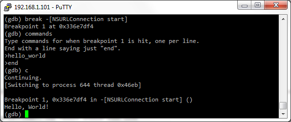

# Variables

We'll say "_define_" many times in this section. This is because we will consider how to _define_ and use variables in user-_defined_ commands :) The variable should be defined with `set` statement and should start with `$`, for example:

	define hello_with_variable
	  set $hello_world="Hello, World!\n"
	  printf "%s", $hello_world
	end

Here is how it looks in GDB console:

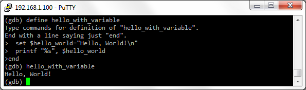

Note that the value of a non initialized variable is `void`. For example, let's define a command which prints the non initialized variable `$a`.

	define print_non_init_var
	   print $a
	end

If we execute the command, we will see something like:

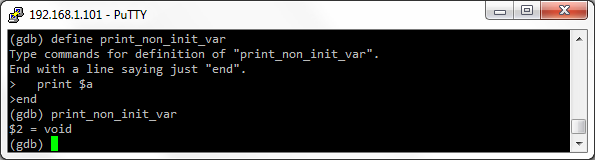

Also please note that all variables in user-defined commands behavior like global variables during debugging session (the only exception is arguments, see the sections below for details). Let's consider a toy example with two user-defined commands:

	define set_i_to_12345
	  set $i=12345
	  printf "$i set to %u\n", $i
	end
	
	define print_i
	  printf "Now $i is %u\n", $i
	end

Execute `print_i` after `set_i_to_12345`, and we'll see

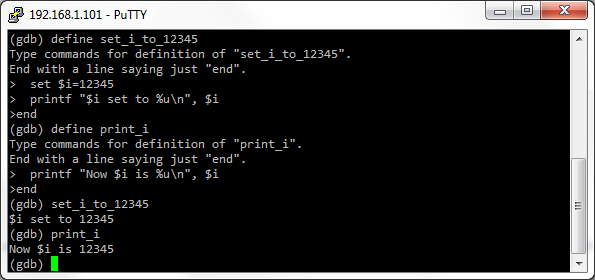

I.e. the variable `$i`, defined inside `set_i_to_12345`, is visible for other user-defined commands. Moreover, the variable can be modified by other user-defined commands. Let's define another user-defined command

	define change_i_to_5678
	  set $i=5678
	  printf "$i is set to %u\n", $i
	end

and execute it. The value of the variable `$i` will be changed to `5678`:

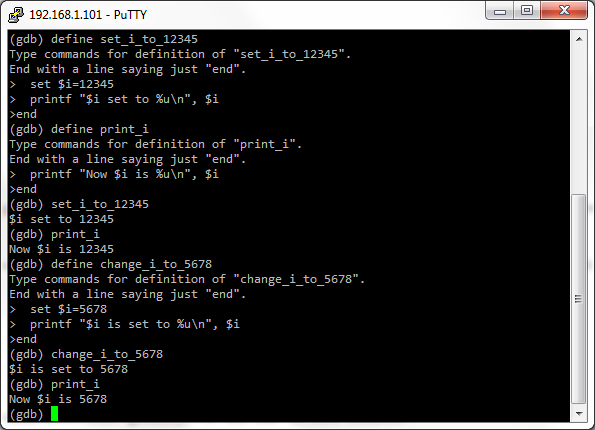

# Arguments

Arguments of a user-defined command are variables `$arg0`, `$arg1`, `$arg2` etc. For example,

	define print_string
	  printf "%s\n", $arg0
	end

Now we can pass a string as an argument to `print_string` and the command will print the string:

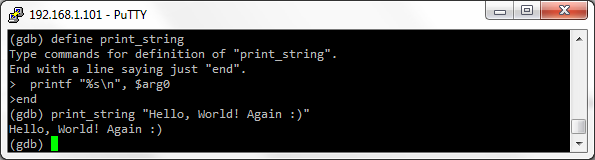

If we pass no arguments, we'll get an error message:

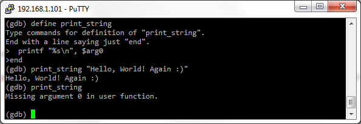

To avoid the error, we should check the variable `$argc` somewhere inside our user-defined command with `if...else` statement (please find more about conditional execution in the next sections):

	define smart_print_string
	  if $argc==1
	    printf "%s\n", $arg0
	  else
	    printf "How to use:\nsmart_print_string <string to print>\n"
	  end
	end

As you probably already guess, the variable `$argc` contains the count of arguments passed to the user-defined command. If we execute `smart_print_string` without arguments, we'll get

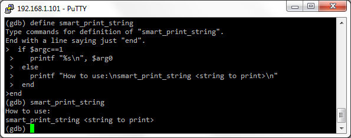

Please note that arguments are the only _local_ variables in a user-defined command.

# Objective C runtime structures as arguments

A really cool thing is we can pass Objective C runtime structures (classes, class instances, properties etc; in fact, all these objects are [just C structures](http://opensource.apple.com/source/objc4/objc4-437/runtime/objc-runtime-new.h) in memory) as parameters to a user-defined command. For example, let `r0` contains a pointer to an instance of a class, and we want to know the name of the class. Let's define the following command:

	define what_is_class_name
	  po $arg0
	end

If we run the command and pass the pointer to an instance of a class (in `r0`), the command will print the class name and the instance address (we use `po` command to output information about the class instance to GDB console):

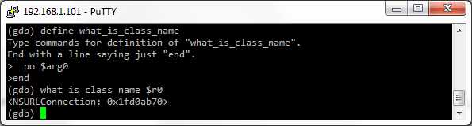

You probably know that we can access Objective C runtime structures with square brackets `[]`. Unfortunately, we can't pass something in square brackets directly to the a user-defined command. For example, if `r0` points to an instance of `NSURLConnection`, we can't just execute

	(gdb) what_is_class_name [$r0 currentRequest]

to get the information about the property `currentRequest`:

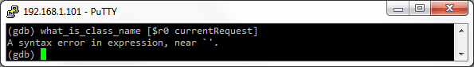

A possible solution is to define a new variable, which points to the property `currentRequest`, and pass it into the user-defined command. However if we try to do it without typecasting, we will get another error:

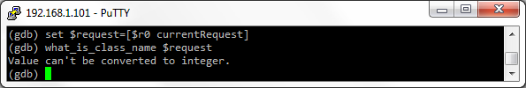

We should cast the pointer to `int`, and then pass the variable to the user-defined command:

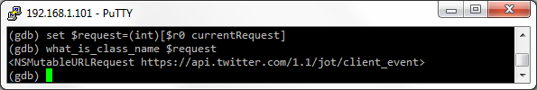

Another way is putting `[$r0 currentRequest]` to a variable and cast it to `int` inside our user-defined command:

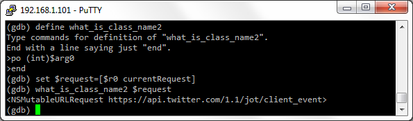

I know, it looks weird because the type of `currentRequest` is definitely _not_ `int`, however we _need_ to cast it to `int`. We will not discuss the reasons, sorry. Just take it as the rule :)

# Passing variables to Objective C methods

We can pass variables and arguments (because arguments are variables too) to Objective C methods as parameters. For example, consider the following user-defined command:

	define key_value_element
	  po [[$arg0 allKeys] objectAtIndex:$arg1]
	  po [[$arg0 allValues] objectAtIndex:$arg1]
	end

The command prints a key/value pair from `NSDictionary`. It takes a pointer to `NSDictionary` instance (in `$arg0`) and the number of the key/value pair to print (in `$arg1`). Then  `$arg1` is passed as a parameter to  `objectAtIndex` method to get objects for the key and value. For example, if `r0` points to an instance of `NSURLConnection`, we can use the command to print the second HTTP header key/value pair:

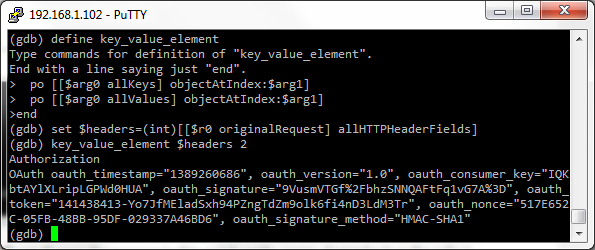

Please, pay attention that we can't pass `[[$r0 originalRequest] allHTTPHeaderFields]` directly to the  `key_value_element` command (see the previous section for details). First we have to cast it to `int` and wrap into a variable:

	(gdb) set $headers=(int)[[$r0 originalRequest] allHTTPHeaderFields]

# Passing variables to C functions

We can pass variables and arguments (because arguments are variables too) to Objective C methods as parameters. Here is an example user-defined command:

	define string_length
	  set $length = (int)strlen((char*)$arg0)
	  printf "The length is %u\n", $length
	end

Please, note that we have cast `$arg0` to ` char*` and cast the returned value to `int`. This is a very important point! Calling C functions, we should cast function parameters and a returned value to primitive types as `char*`, `int` etc. Here is an example of how  `string_length` works:

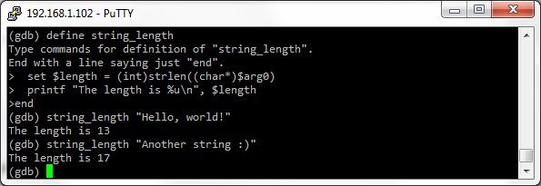

# Conditional execution

To execute something conditionally in a user-defined command, we should use `if...else` statements. The syntax is simple:

	if _<condition>_
	  _...do something here..._
	  else
	  _...do something else here..._
	end

or (without `else`):

	if _<condition>_
	  _...do something here..._
	end

If we have read the previous sections, we probably already saw the following example:

	define smart_print_string
	  if $argc==1
	    printf "%s\n", $arg0
	  else
	    printf "How to use:\nsmart_print_string <string to print>\n"
	  end
	end

The condition in the example above is simple: we just check if the variable `$argc` is equal to `1`. We can use more complex conditions with almost all logical operations known from C/C++: `==` (is equal to), `!=` (is not equal to), `&&` (and), `||` (or) etc. The syntax is exactly as in C/C++.

Also we can use nested `if...else` statements:

	define smart_print_string
	  if $argc==1
	    if $arg0!=0
	      printf "%s\n", $arg0
	    else
	      printf "You have passed a zero pointer!\n"
	    end
	  else
	    printf "How to use:\nsmart_print_string <string to print>\n"
	  end
	end

It works as follows

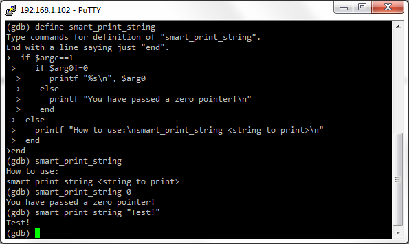

Moreover, sometimes we _must_ use nested `if...else` statements. Let's try to "optimize" the code of  `smart_print_string` command. Remove the nested `if...else` statement and put both checks (`$argc==1` and `$arg0!=0`) to a single condition:

	define smart_print_string_optimized
	  if $argc==1 && $arg0!=0
	    printf "%s\n", $arg0
	  else
	    printf "How to use:\nsmart_print_string <string to print>\n"
	    printf "where <string to print> is not a zero pointer!\n"
	  end
	end

Looks better, yeah? But if we try to run the command without arguments...

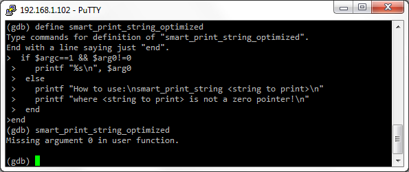

We got the error "Missing argument 0 in user function" because GDB parsed the condition  `$argc==1 && $arg0!=0`  as follows:

1. First GDB checked `$argc==1`, it was `false` because we did no pass any arguments to the command.
2. It was not necessary to check `$arg0!=0`. Indeed, if `$argc==1` is `false`, then `$argc==1 && $arg0!=0`  is `false` in any case. However, GDB checked `$arg0!=0` anyway. Of course, `$arg0` was not defined (remember? we did not pass any arguments), so GDB printed the error message.

We should always keep in mind that GDB continue checking condition even it makes no sense (like in the example above).

# Loops

The loop statement is `while`:

	while _<condition>_
	  _...do something here..._
	end

Nested loops are allowed. The rules for conditions are the same as for `if...else` (see the previous section for details). It is important to set correct conditions for `while`, otherwise we can run into infinite loop. E.g. the following loop will never end:

	set $i = 1 
	while $i<10
	  printf "What? I do not increment $i inside the loop?\n"
	  printf "Oh sh... Stop the loop! Let me out!..\n"
	end

Here is an example of user-defined command with `while` statement:

	define s_count_a
	  set $count = 0
	  set $char = $arg0
	  while *(char*)$char!=0
	    if *(char*)$char == 'a'
	      set $count = $count + 1 
	    end
	    set $char = $char + 1
	  end
	  printf "We saw 'a' %u times\n", $count
	end

The command counts `'a'` characters in a string. The string should be passed in `$arg0`:

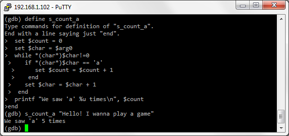

# Conditions with C functions and Objective C methods calling

We can use return values from Objective C methods and C functions in expressions for `if...else` and `while`. Calling C functions, we should cast parameters and return values to primitive types:

	if (int)strcmp((char*)$string1, (char*)$string2) == 0
	  printf "The strings are equal!\n"
	end

We also can wrap the return value with a variable:

	set $compare_result = (int)strcmp((char*)$string1, (char*)$string2)
	if $compare_result==0
	  printf "The strings are equal!\n"
	end

It is not necessary, but sometimes can make our code more readable.

Here is a complete example of a user-defined command with C function calling in an `if...else` condition:

	define compare_str
	  if (int)strcmp((char*)$arg0, (char*)$arg1) == 0
	    printf "The strings are equal!\n"
	  else
	    printf "The strings are NOT equal!\n"
	  end
	end

It works like this:

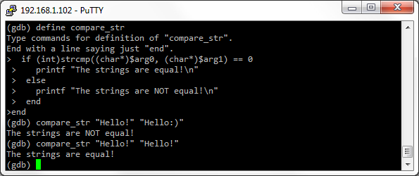

We can also use return values from Objective C methods to build conditions. Here is an example of a user-defined command:

	define list_http_headers
	 set $count = (int)[[[$arg0 currentRequest] allHTTPHeaderFields] count]
	 set $i = 0
	 while $i < $count
	   printf "Header %u:\n", $i+1
	   po [[[[$arg0 currentRequest] allHTTPHeaderFields] allKeys] objectAtIndex:$i]
	   po [[[[$arg0 currentRequest] allHTTPHeaderFields] allValues] objectAtIndex:$i]
	   set $i = $i + 1
	 end
	end

The command takes a pointer to an instance of `NSURLConnection` (in `$arg0`) and prints a list of headers of `currentRequest`. In the example below, the pointer is in r0 register (BTW, it's a typical situation after break on  `-[NSURLConnection start]`):

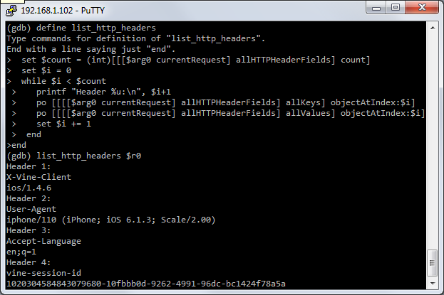

# Using `printf` for pretty-looking output

The `printf` is used to print primitive types like `(char*)`, `int` etc. In some situation, it allows us to print something really nice and readable :) For example, let's rework our `list_http_headers` command. Let it prints pretty-looking pairs

	<HTTP header name>: <HTTP header value>

The reworked `list_http_headers` command may look like

	define printf_pretty_http_headers
	 set $all_headers = (int) [[$arg0 currentRequest] allHTTPHeaderFields]
	 set $count = (int)[[$request allHTTPHeaderFields] count]
	 set $i = 0
	 while $i < $count
	   set $header = (char*)[[[[$all_headers allKeys] objectAtIndex:$i] description] UTF8String]
	   set $value = (char*)[[[[$all_headers allValues] objectAtIndex:$i] description] UTF8String]
	   printf "%s: %s\n", $header, $value
	   set $i += 1
	 end
	 printf "--- Total %u headers ---\n", $count
	end

The `list_http_headers` command used `po` to print the name/value pairs. So it was enough to pass a return value of  `objectAtIndex:` to `po`,  and - viola! - `po` prints a string. However, we cant pass a return value of `objectAtIndex:` to `printf`, because `objectAtIndex:` returns not a primitive type, but an object. This is the reason why we should go deeper :) through object's  `description` to `UTF8String`, which is a primitive type (it's a pointer to an array of chars) and can be printed with `printf`. It works like this:

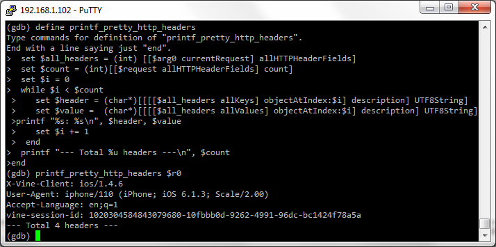

# Summary

We can say a lot of things about user-defined GDB commands, but it's time to finish our discussion :) Finally, here are some pros and cons of user-defined GDB commands. Pros:

* Simple syntax.
* No third-part  interpreters (e.g. Python) are needed, no environment customization is required, user-defined commands just work.

Cons:

* All variables are global (excepting arguments), idiotic typecasting, dummy condition checking and other stupid things.
* There is no ability to control GDB engine.
* User-defined commands are slow for even the most trivial tasks (e.g. printing a string). Really.

# Useful links

Actually, the only link I found is [User-defined Commands](http://sourceware.org/gdb/onlinedocs/gdb/Define.html).

So it goes.