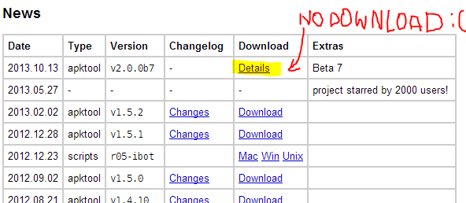
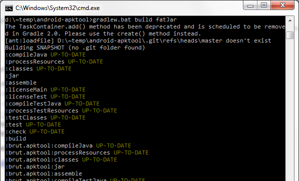
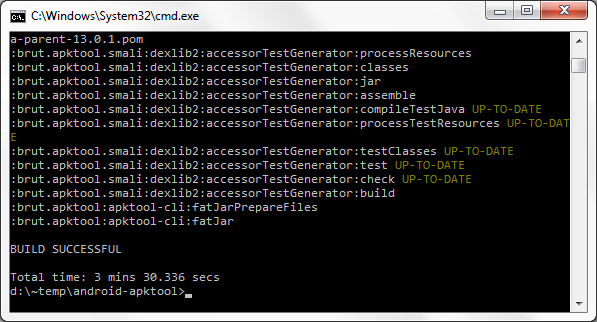
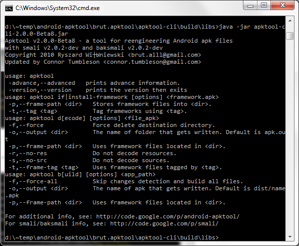

Android-apktool 2.00 promises a lot of cool things: Smali/Backsmali 2.0, Smali debugging (last time we saw this great feature in android-apktool 1.4.1, it broke in 1.4.2 and later releases, and now it's back!), numerous bugfixes etc. The only problem is the version 2.00 is not released at the moment.<!-- more --> It's still in beta, no compiled JARs are available on [the download page](https://code.google.com/p/android-apktool/):



So this post is for reverse engineers who want to build android-apktool of version 2.00 (beta) from sources and play with all that cool stuff right now :) Here is a detailed 1-2-3 steps instruction for Windows (it's based on [the wiki page](https://code.google.com/p/android-apktool/wiki/BuildApktool), I just added some screenshots and notes).

# Step 1

Check prerequisites:

* Windows PC
* Java 1.7 installed
* `aapt.exe` in PATH

# Step 2

Download [ZIP archive with the latest sources](https://android-apktool.googlecode.com/archive/wip-2.0.zip) and unzip it to any local folder, e.g. to `d:\~temp\android-apktool\`. By the way, if you have no `aapt.exe` on your PC, you can find it in `d:\~temp\android-apktool\brut.apktool\apktool-lib\src\main\resources\prebuilt\aapt\windows\` and add it to your PATH after the second step. 

# Step 3 

Open CMD console, go to `d:\~temp\android-apktool\`, and run 

```
gradlew.bat build fatJar
```

Building is started now:



After 3-5 minutes, you should see:

 

Well, now just go to `d:\~temp\android-apktool\brut.apktool\apktool-cli\build\libs\` and find the `.jar` file there. Check if it is the JAR you need:



Yes, it was so easy :)

