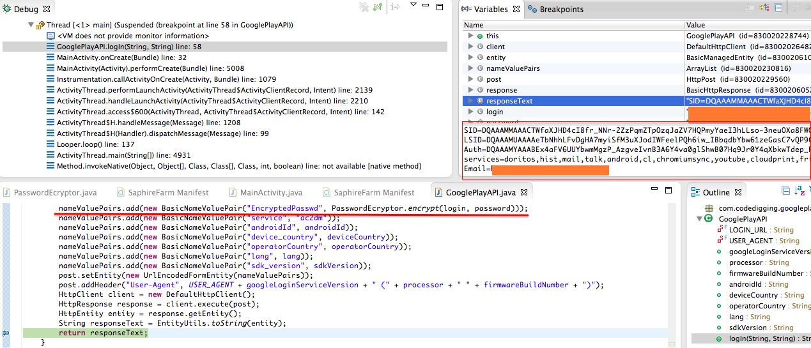

Just a quick word about `EncryptedPasswd` parameter.<!-- more --> Sniffing traffic between an Android device and Google Play, one can see that login to Google Play is just a POST request like this: 

```
POST /auth HTTP/1.1
Content-Type: application/x-www-form-urlencoded
Content-Length: 404
Host: android.clients.google.com
Connection: Keep-Alive
User-Agent: GoogleLoginService/1.3 (a10 JZO54K)

accountType=HOSTED_OR_GOOGLE&Email=testemail%40gmail.com&has_permission=1&add_account=1&EncryptedPasswd=AFcb4KS9WAU3NI_-jdMDSueqT-oO1-WN2B9pxB-te_Elx3MElC9B2TgAaWqkY7kiQSnGFEwaY1KVkizxadGsRnFnHa7vlRCrB4Me1XnHBuOz9oi48eBcm0rC7r8QaC_GPp1YPI8OFa0fZU_dTJypganc2tREsgE-_TJQSKWkA7zSWnsq8g%3D%3D&service=ac2dm&source=android&androidId=378b05ab23e0e8e9&device_country=ua&operatorCountry=ua&lang=en&sdk_version=16
```

The request headers and parameters are more or less clear, except `EncryptedPasswd` parameter. Google search gives nothing useful, Chinese RCE forums contain no information about the parameter, even Adam Goodman did not explain the parameter in [his great research on bypassing Google's two-factor authentication](https://www.duosecurity.com/blog/bypassing-googles-two-factor-authentication). Adam just wrote 

> [Another of Elenkov’s blog posts](http://nelenkov.blogspot.com/2012/11/android-online-account-management.html) led us to believe that `EncryptedPasswd` might be our ASP, encrypted with a 1024-bit RSA public key included in the Android system. EncryptedPasswd was, in fact, 130 bytes of (base64-encoded) binary data, so this seems quite possible.

and replaced `EncryptedPasswd` with a plain-text `Passwd` parameter. That replacement worked for Adam and it's great, but what's the hell is `EncryptedPasswd`? To clarify this, I've reversed `com.google.android.gsf.loginservice.PasswordEncrypter` class in `com.google.android.gsf.login`. As result, I got the following Java code: 

```
// The Google public key
private static final String googleDefaultPublicKey = "AAAAgMom/1a/v0lblO2Ubrt60J2gcuXSljGFQXgcyZWveWLEwo6prwgi3iJIZdodyhKZQrNWp5nKJ3srRXcUW+F1BD3baEVGcmEgqaLZUNBjm057pKRI16kB0YppeGx5qIQ5QjKzsR8ETQbKLNWgRY0QRNVz34kMJR3P/LgHax/6rmf5AAAAAwEAAQ==";
	
// In:
//   login - your mail, should looks like myemail@gmail.com
//   password - your password
// Out:
//   a base64 string containing the encrypted password 
	
// !!!!!!!!!!!!!!!!!!!!!!!!!!!!!!!!!!!!!!!!!!!!!!!!!!!!!!!!!!!!!!!!!!!!!!!!!!!!
// WARNING!!! THE CODE WORKS CORRECTLY ONLY IF THE LENGTH OF login+password
// IS LESS THAT 80 CHARS (YES, DO NOT CHECK IT IN THE METHOD, I'M A CRAPPY
// JAVA CODER :))
// !!!!!!!!!!!!!!!!!!!!!!!!!!!!!!!!!!!!!!!!!!!!!!!!!!!!!!!!!!!!!!!!!!!!!!!!!!!!
	
@SuppressWarnings("static-access")
    public static String encrypt(String login, String password)
     throws NoSuchAlgorithmException, InvalidKeySpecException,
     NoSuchPaddingException, UnsupportedEncodingException,
     InvalidKeyException, IllegalBlockSizeException, 
     BadPaddingException {
 
 // First of all, let's convert Google login public key from base64
 // to PublicKey, and then calculate SHA-1 of the key:
 
 // 1. Converting Google login public key from base64 to byte[]
     byte[] binaryKey = Base64.decode(googleDefaultPublicKey, 0);
 
 // 2. Calculating the first BigInteger
     int i = readInt(binaryKey, 0);
     byte [] half = new byte[i];
     System.arraycopy(binaryKey, 4, half, 0, i);
     BigInteger firstKeyInteger = new BigInteger(1, half);
 
 // 3. Calculating the second BigInteger
     int j = readInt(binaryKey, i + 4);
     half = new byte[j];
     System.arraycopy(binaryKey, i + 8, half, 0, j);
     BigInteger secondKeyInteger = new BigInteger(1, half);
 
 // 4. Let's calculate SHA-1 of the public key, and put it to signature[]:
 // signature[0] = 0 (always 0!)
 // signature[1...4] = first 4 bytes of SHA-1 of the public key
     byte[] sha1 = MessageDigest.getInstance("SHA-1").digest(binaryKey);
     byte[] signature = new byte[5];
     signature[0] = 0;
     System.arraycopy(sha1, 0, signature, 1, 4);
 
 // 5. Use the BigInteger's (see calculations above) to generate
 // a PublicKey object
     PublicKey publicKey = KeyFactory.getInstance("RSA").
     generatePublic(new RSAPublicKeySpec(firstKeyInteger, secondKeyInteger));
	 
 // It's time to encrypt our password:
 // 1. Let's create Cipher:
     Cipher cipher = Cipher.getInstance("RSA/ECB/OAEPWITHSHA1ANDMGF1PADDING");
 
 // 2. Then concatenate the login and password (use "\u0000" as a separator):
     String combined = login + "\u0000" + password;
 
 // 3. Then converting the string to bytes
     byte[] plain = combined.getBytes("UTF-8");
 
 // 4. and encrypt the bytes with the public key:
     cipher.init(cipher.PUBLIC_KEY, publicKey);
     byte[] encrypted = cipher.doFinal(plain);
 
 // 5. Add the result to a byte array output[] of 133 bytes length:
 // output[0] = 0 (always 0!)
 // output[1...4] = first 4 bytes of SHA-1 of the public key
 // output[5...132] = encrypted login+password ("\u0000" is used as a separator)
     byte[] output = new byte [133];
     System.arraycopy(signature, 0, output, 0, signature.length);
     System.arraycopy(encrypted, 0, output, signature.length, encrypted.length);
	 
 // Done! Just encrypt the result as base64 string and return it
     return Base64.encodeToString(output, Base64.URL_SAFE + Base64.NO_WRAP);
    }
	
// Aux. method, it takes 4 bytes from a byte array and turns the bytes to int
    private static int readInt(byte[] arrayOfByte, int start) {
     return 0x0 | (0xFF & arrayOfByte[start]) << 24 | (0xFF & arrayOfByte[(start + 1)]) << 16 | (0xFF & arrayOfByte[(start + 2)]) << 8 | 0xFF & arrayOfByte[(start + 3)];
    }
```

Well, the code is ugly, but it works. Google servers answer with SID, LSID, Auth and all that funny authorization stuff. Here is a proof screen from my Eclipse IDE:



So it goes.
