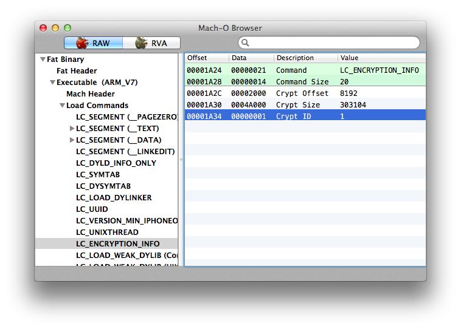

Another "ultimate" guide (he-he :)) to decrypting iOS applications from AppStore. It's based on my 2 years experience. I hope somebody finds it useful. Questions are welcome in comments.

# The sandbox

* Mac with the latest OS X installed
* [MachOView](http://sourceforge.net/projects/machoview/) 2.4 (9200) installed on the Mac
* a jailbroken iOS device with OpenSSH
* [LLDB installed on the iPhone](../2014-02-14-installing-lldb/installing-lldb.md)

# Preparations

Install the app you want to disassemble, e.g. Samsung Content Viewer, to a jailbroken iOS device and start it. Then ssh the device and use `ps` command to list the running processes. Find the app in the list and note the executable location (usually `/var/mobile/Applications/...`):


	# ps ax
	  PID   TT  STAT      TIME COMMAND
	    1   ??  Ss     1:52.90 /sbin/launchd
	   19   ??  Ss     9:47.09 /usr/libexec/UserEventAgent (System)
	   20   ??  Ss     0:34.87 /usr/libexec/aosnotifyd
	   ...blah blah blah...
	   7267   ??  SXs    1:45.30 /var/mobile/Applications/90465493-2318-41AC-9624-E91697EB70DA/Samsung Content Viewer.app/Samsung Content Viewer
	   ...blah blah blah...
	   7471 s001  Ss     0:00.04 -sh
	   7472 s001  R+     0:00.01 ps ax

Use `scp` in Mac console to copy the executable to a local folder:

```
$ scp root@192.168.1.110:"/var/mobile/Applications/90465493-2318-41AC-9624-E91697EB70DA/Samsung\ Content\ Viewer.app/Samsung\ Content\ Viewer" ./
```

# Multiple architectures

Again, consider Samsung Content Viewer as an example of a multiple architectures executable. List the architectures:

```
$ otool -fh Samsung\ Content\ Viewer 
Fat headers
fat_magic 0xcafebabe
nfat_arch 2
architecture 0
    cputype 12
    cpusubtype 9
    capabilities 0x0
    offset 4096
    size 399568
    align 2^12 (4096)
architecture 1
    cputype 12
    cpusubtype 11
    capabilities 0x0
    offset 405504
    size 399568
    align 2^12 (4096)
Samsung Content Viewer (architecture armv7):
Mach header
      magic cputype cpusubtype  caps    filetype ncmds sizeofcmds      flags
 0xfeedface      12          9  0x00          2    36       4364 0x00200085
Samsung Content Viewer (architecture armv7s):
Mach header
      magic cputype cpusubtype  caps    filetype ncmds sizeofcmds      flags
 0xfeedface      12         11  0x00          2    36       4364 0x00200085
```

Choose the architecture you want to disassemble, for example armv7, and remember `offset` from the output above (`4096` for armv7 in the output). Then use `otool` to find encrypted offset/size for the architecture you want to disassemble, e.g. for armv7:

```
$ otool -arch armv7 -l Samsung\ Content\ Viewer | grep crypt
    cryptoff  8192
    cryptsize 303104
    cryptid   1
```

Now ssh the iOS device, connect `debugserver` to the application (remember? it's still running), then connect `lldb` to `debugserver` and find offset of the executable image in memory:

```
(lldb) image list Samsung\ Content\ Viewer
[  0] 87CACFC1-CD0D-3572-A454-20EEB4C20DA6 0x0003e000 /var/mobile/Applications/90465493-2318-41AC-9624-E91697EB70DA/Samsung Content Viewer.app/Samsung Content Viewer (0x000000000003e000)
```

For the example above, the image offset is `0x0003e000`.

**Warning!** Two important things:

* The device architecture should be the same as the architecture we want to disassembly.
* If the executable was compiled with PIE (ASLR) option, the image offset changes each time application starts. ■

Then dump the the encrypted part of the executable. Use the following lldb command:

```
(lldb) memory read --force --outfile ./decrypted.bin --binary --count <cryptsize> <image offset>+<cryptoff>
```

For Samsung Content Viewer:

```
(lldb) memory read --force --outfile ./decrypted.bin --binary --count 303104 0x0003e000+8192
```

Finally, backup the `Samsung\ Content\ Viewer` executable

```
$ cp Samsung\ Content\ Viewer Samsung\ Content\ Viewer-orig
```

and insert `decrypted.bin` into the executable

```
$ dd seek=12288 bs=1 conv=notrunc if=./decrypted.bin of=./Samsung\ Content\ Viewer
```

where `12288=4096+8192` is the offset for armv7 architecture (see the output of `otool -fh` above) plus `cryptoff`. Optionally, to make the executable suitable for some tools (e.g. `class-dump-z`), you can set `cryptid` to `0` (see "Setting cryptid to `0`" below).

# A single architecture (with a fat header)

For a single architecture with a fat header, e.g. for `Kik` executable, the dump looks like

```
$ otool -fh Kik 
Fat headers
fat_magic 0xcafebabe
nfat_arch 1
architecture 0
    cputype 12
    cpusubtype 9
    capabilities 0x0
    offset 16384
    size 9533024
    align 2^14 (16384)
Kik-decrypted (architecture armv7):
Mach header
      magic cputype cpusubtype  caps    filetype ncmds sizeofcmds      flags
 0xfeedface      12          9  0x00           2    51       5264 0x00218085
```

Use `otool` to find encrypted offset/size

```
$ otool -l Kik | grep crypt
     cryptoff 16384
    cryptsize 4374528
      cryptid 1
```

Run the application on your iOS device and ssh the device. Then connect debugserver to the application, connect lldb to debugserver and find offset of the executable image in memory:

```
(lldb) image list Kik
[  0] FB5FE5B3-7C7F-3FBC-A5FA-45BF437D0DE1 0x000f3000 /var/mobile/Applications/91C53383-3F9E-4656-9593-08FCFDA8ADCC/Kik-Release-8.7.0.1913.app/Kik (0x00000000000f3000)
```

The offset for `Kik` image is 0x000f3000.

---

**Warning!** If the executable was compiled with PIE (ASLR) flag, the image offset changes every application start.

---

Let's dump the encrypted part of the application with the following lldb command:

```	
(lldb) memory read --force --outfile ./decrypted.bin --binary --count <cryptsize> <image offset>+<cryptoff>
```

e.g. for Kik:

```
(lldb) memory read --force --outfile ./decrypted-kik.bin --binary --count 3801088 0x000f3000+16384
3801088 bytes written to './decrypted.bin'
```

Finally, let's insert `decrypted.bin` into the executable:

```
$ dd seek=<arch. offset + cryptoff> bs=1 conv=notrunc if=./decrypted.bin of=./Kik
```

where 

* `arch. offset` came from `otool -fh Kik` output (this is the `offset` for architecture 0)
* `cryptoff` came from `otool -l Kik | grep crypt` output

For example, for `Kik` we have

```
$ dd seek=0x8000 bs=1 conv=notrunc if=./decrypted.bin of=./Kik
3801088+0 records in
3801088+0 records out
3801088 bytes transferred in 5.966411 secs (637081 bytes/sec)
```

where `0x8000` = `arch. offset` (`0x4000` in hex) + `cryptoff` (`0x4000` in hex).

Optionally, to make the executable suitable for some tools (e.g. `class-dump-z`), you can set `cryptid` to 0 (see “Setting cryptid to `0`” below).

# A single architecture (without a fat header)

For a single architecture binary without fat header, e.g. for `Instagram`, `otool` output looks like

```
$ otool -fh Instagram 
Instagram:
Mach header
      magic cputype cpusubtype  caps    filetype ncmds sizeofcmds      flags
 0xfeedface      12          9  0x00           2    57       6112 0x00218085
```

Use `otool` to find encrypted offset/size:

```
$ otool -l Instagram | grep crypt
     cryptoff 16384
    cryptsize 6733824
      cryptid 1
```

Run the application on your iOS device and ssh the device. Then connect debugserver to the application, connect lldb to debugserver and find offset of the executable image in memory:

```
(lldb) image list Instagram
[  0] BC3DD8FF-81FB-30B9-AB89-50B9F85D337C 0x00033000 /var/mobile/Containers/Bundle/Application/74FF094E-2B4B-4793-956C-7BB88FCB5D4A/Instagram.app/Instagram (0x0000000000033000)
```

The offset for `Instagram` image is `0x00033000`.

---

**Warning!** If the executable was compiled with PIE (ASLR) flag, the image offset changes every application start.

---

Let's dump the encrypted part of the application with the following lldb command:

```
(lldb) memory read --force --outfile <path to dump>.bin --binary --count <cryptsize> <image offset>+<cryptoff>
```

e.g. for Instagram:

```
(lldb) memory read --force --outfile ~/decrypted-instagram.bin --binary --count 6733824 0x00033000+16384
```

Finally, let's insert decrypted bytes from `<path to dump>.bin` into the executable: 

```
$ dd seek=<cryptoff> bs=1 conv=notrunc if=<path to dump>.bin of=<path to the original executable>
```

e.g. for Instagram

```
$ dd seek=16384 bs=1 conv=notrunc if=~/decrypted-instagram.bin of=./Instagram
```

Optionally, to make the executable suitable for some tools (e.g. `class-dump-z`), you can set `cryptid` to `0` (see “Setting cryptid to `0`” below). 

# Setting cryptid to `0`

Just find the offset of `cryptid` with MachOView:



Double click on `Data` for `Crypt ID`, set it to `0` and press CMD+S to save the binary. Or, if you don't like to edit files in MachO View, open the executable in any hex editor, go to the offset and replace `1` with `0`.

# Links

* [Decrypting apps on iOS 6 – Part 1: single architecture](http://rce64.wordpress.com/2013/01/26/decrypting-apps-on-ios-6-single-architecture-no-pieaslr/)
* [Decrypting apps on iOS 6 – Part 2: multiple architectures and PIE](http://rce64.wordpress.com/2013/01/27/private-decrypting-apps-on-ios-6-multiple-architectures-and-pie/)
* [DECRYPTING IOS APPS](http://resources.infosecinstitute.com/ios-application-security-part-2-getting-class-information-of-ios-apps/)
* [http://www.rsaconference.com/writable/presentations/file_upload/hta-r04a-hacking-ios-on-the-run-using-cycript.pdf](http://www.rsaconference.com/writable/presentations/file_upload/hta-r04a-hacking-ios-on-the-run-using-cycript.pdf)
* [http://www.infointox.net/?p=114](http://www.infointox.net/?p=114)
* [Decrypting iOS binaries](http://www.mandalorian.com/2013/05/decrypting-ios-binaries/)
* [Decrypting IOS app to access Class Information](http://timourrashed.com/decrypting-ios-app/)