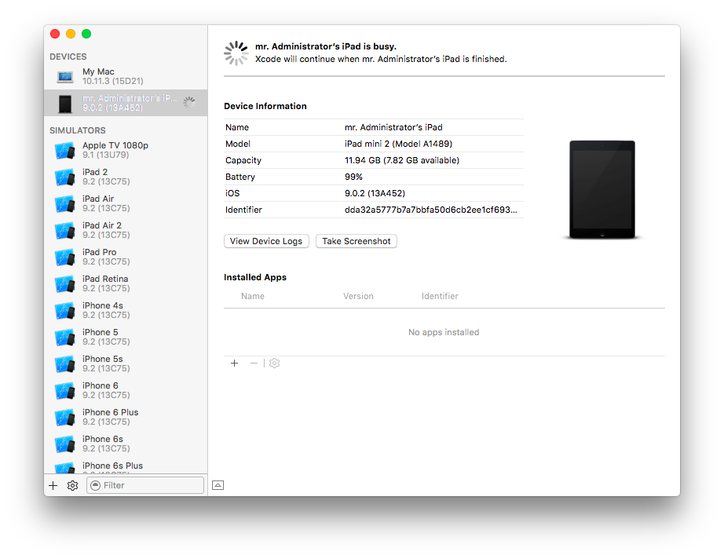
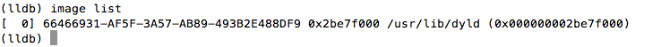
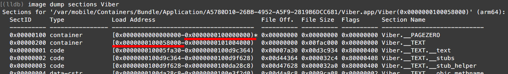
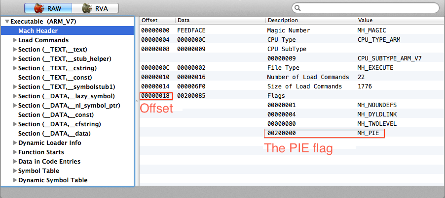
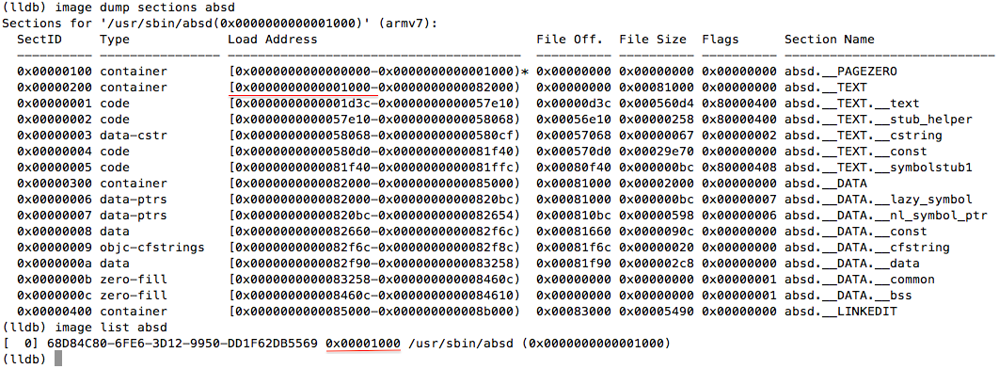

This is an extended version of [the guide I posted in 2014](../2014-02-14-installing-lldb/). It covers iOS 7-9 for ARM32 and 64 bit processors. Please note that LLDB is quite buggy, so some things may not work for you, or work in a wrong way. Shit happens, sorry.

# Preparing the sandbox

## Environment

You need:

1. Mac with the latest XCode installed
2. a jailbroken iPhone/iPad/iPod with OpenSSH installed
3. [MachOView](https://sourceforge.net/projects/machoview/) installed on the Mac

## Excracting `debugserver`

Extract `debugserver` from XCode. On Mac, run in console:

```
$ ls /Applications/Xcode.app/Contents/Developer/Platforms/iPhoneOS.platform/DeviceSupport/
```

As result, you see available iOS versions in your console, e.g.

```
6.0   7.0   8.0   8.2   8.4   9.1
6.1   7.1   8.1   8.3   9.0   9.2 (13C75)
```

Choose the iOS version running on your iOS device. Let it be `7.1`. Extract `debugserver` for iOS 7.1:

```
$ hdiutil attach /Applications/Xcode.app/Contents/Developer/Platforms/iPhoneOS.platform/DeviceSupport/7.1/DeveloperDiskImage.dmg
$ cp /Volumes/DeveloperDiskImage/usr/bin/debugserver ./
```
---

**Note!** `debugserver` is so-called "universal binary" with MachO fat header, it contains both ARM32 and ARM64 binaries, so don't care bitwise.

---

Now you have `debugserver` binary in your current directory on your Mac. 

## Signing `debugserver`

Sign `debugserver` with the following command

```
$ codesign -s - --entitlements entitlements.plist -f debugserver
```

where `entitlements.plist` is a text file:

```
<?xml version="1.0" encoding="UTF-8"?>
<!DOCTYPE plist PUBLIC "-//Apple//DTD PLIST 1.0//EN" "http://www.apple.com/DTDs/ PropertyList-1.0.dtd">
<plist version="1.0">
<dict>
	<key>com.apple.springboard.debugapplications</key> <true/>
	<key>run-unsigned-code</key> <true/>
	<key>get-task-allow</key> <true/>
	<key>task_for_pid-allow</key> <true/>
</dict> 
</plist>
```

You can download `entitlements.plist` [here](entitlements.plist).

## Copying `debugserver` to iOS device

Find IP of your iOS device, e.g. `192.168.0.101`. Copy `debugserver` to your iOS device:

```
$ scp ./debugserver root@192.168.0.101:/usr/bin/
```

If you use `usbmuxd` (see "Debugging through USB" for more info), you can run

```
$ scp -P 2222 ./debugserver root@localhost:/usr/bin/
```

## First start

Start "Settings" on your iOS device. SSH your the device and run in SSH console:

```
# ps ax
```

As result, you see the list of running process. Check "Settings", it should appear in the list as `Preferences`. Attach `debugserver` to the process:

```
# debugserver *:6666 -a Preferences
```

As result, you see in SSH console:

```
debugserver-310.2 for armv7.
Attaching to process Preferences...
Listening to port 6666 for a connection from *...
```

Now, open a new Mac console and run

```
$ lldb
(lldb) platform select remote-ios
(lldb) process connect connect://192.168.0.101:6666
```

(we still assume iOS device IP is `192.168.0.101`)

Wait 1-2 min and, finally, you'll get the result

```
Process 400 stopped
* thread #1: tid = 0x118f, 0x38bfda58 libsystem_kernel.dylib`mach_msg_trap + 20, queue = 'com.apple.main-thread', stop reason = signal SIGSTOP
    frame #0: 0x38bfda58 libsystem_kernel.dylib`mach_msg_trap + 20
libsystem_kernel.dylib`mach_msg_trap:
->  0x38bfda58 <+20>: pop    {r4, r5, r6, r8}
    0x38bfda5c <+24>: bx     lr

libsystem_kernel.dylib`mach_msg_overwrite_trap:
    0x38bfda60 <+0>:  mov    r12, sp
    0x38bfda64 <+4>:  push   {r4, r5, r6, r8}
```

## Problems and solutions

### `debugserver` does not start

Check permissions for `debugserver` on iOS device. The correct permissions are

```
-rwxr-xr-x 1 root wheel 1100912 Feb 13 15:30 /usr/bin/debugserver
```

### `lldb` shows the SDK Path error

In LLDB console, you can see "SDK Path: error: unable to locate SDK" message

```
(lldb) platform select remote-ios
  Platform: remote-ios
 Connected: no
  SDK Path: error: unable to locate SDK
```

because

```
~/Library/Developer/Xcode/iOS DeviceSupport/
```

does not exist. Or, your device is running iOS 9.0.2 (13A452), but you see no iOS 9.0.2 (13A452) in the SDK Roots list

```
(lldb) platform select remote-ios
  Platform: remote-ios
 Connected: no
  SDK Path: "/Users/administrator/Library/Developer/Xcode/iOS DeviceSupport/9.0.2 (13A452)"
 SDK Roots: [ 0] "/Users/administrator/Library/Developer/Xcode/iOS DeviceSupport/7.1.2 (11D257)"
```

because 

```
~/Library/Developer/Xcode/iOS DeviceSupport/9.0.2 (13A452)
```

does not exists.

In both cases, you need to

1. run XCode
2. open "Windows" → "Devices"
3. connect your iOS device to your Mac (via USB)
4. if iOS device is not paired to the Mac, skip this step; if it is paired, unpair it the "Devices" window (open context menu on the device and choose "Unpair")
5. pair the iOS device and wait while XCode is extracting symbols:



As resul, `platform select remote-ios` should work as expected and give you something like

```
(lldb) platform select remote-ios
  Platform: remote-ios
 Connected: no
  SDK Path: "/Users/administrator/Library/Developer/Xcode/iOS DeviceSupport/9.0.2 (13A452)"
 SDK Roots: [ 0] "/Users/administrator/Library/Developer/Xcode/iOS DeviceSupport/7.1.2 (11D257)"
 SDK Roots: [ 1] "/Users/administrator/Library/Developer/Xcode/iOS DeviceSupport/9.0.2 (13A452)"
```

# Using `.lldbinit`

Typing

```
(lldb) platform select remote-ios
(lldb) process connect connect://...blah-blah-blah
```

in console each time your start `lldb` is annoying. Put the LLDB commands you run each time you start LLDB in `~/.lldbinit` file and the commands will be executed automatically. For example

```
# .lldbinit example
platform select remote-ios
process connect connect://192.168.0.101:6666
```

In further sections, you can find several examples of useful `.lldbinit` files.

# Debugging through USB

To debug binaries and access iOS device via SSH through USB, follow the instruction:

1. If `usbmuxd` is not installed on your Mac, install it. Run in Mac console:

    ```
    $ brew install usbmuxd
    ```

    (if you have no `brew` installed on your Mac, find the installation instruction on [homebrew page](http://brew.sh/))

2. Open a dedicated console on your Mac, and execute

    ```
    $ iproxy 6666 6666
    ```

    Now, you can connect iOS device to USB port and use

    ```
    (lldb) process connect connect://localhost:6666
    ```

    instead of

    ```
    (lldb) process connect connect://192.168.0.101:6666
    ```

    in LLDB console.

3. Open a dedicated console on your Mac, and execute

    ```
    $ iproxy 2222 22
    ```

    Now, you can connect iOS device to USB port and use

    ```
    $ ssh -p 2222 root@localhost
    ```

    instead of

    ```
    $ ssh root@192.168.0.101
    ```

    in Mac console.

Debugging and SSH-ing iOS devices through USB are faster and much more stable than debugging and SSH-ing through network.

Here is an example of `.lldbinit`, it uses `usbmuxd`:

```
# another .lldbinit example
platform select remote-ios
process connect connect://localhost:6666
```

# Starting debugging

There are several ways to start debugging.

## Attaching to a running process

SSH your jailbroken iOS device, run `ps -ax` to list running processes. Let you need to attach to iMessage GUI process:

```
# ps -ax 
  PID TTY           TIME CMD
    ...
 2953 ??         0:02.27 /Applications/MobileSMS.app/MobileSMS
    ...
```

To attach `debugserver` to the process, use the PID
​	
```
# debugserver *:6666 -a 2953
```

or the process name
​	
```
# debugserver *:6666 -a MobileSMS
```

Then run LLDB on your Mac and connect `debugserver` via network

```
(lldb) platform select remote-ios
(lldb) process connect connect://192.168.0.101:6666
```

or USB

```
(lldb) platform select remote-ios
(lldb) process connect connect://localhost:6666
```

(see "First start" and "Debugging through USB" above for details)

Now it's ready for debugging.

## Waiting for a process

Make sure the app you want to debug is not running. Let you need to debug iMessage GUI (the `/Applications/MobileSMS.app/MobileSMS` executable). SSH your jailbroken iOS device and run in the SSH console

```
# debugserver *:6666 -waitfor MobileSMS
```

Run the iMessage GUI manually (just tap its icon in the iOS device), then run LLDB on your Mac and connect `debugserver` via network

```
(lldb) platform select remote-ios
(lldb) process connect connect://192.168.0.101:6666
```

or USB

```
(lldb) platform select remote-ios
(lldb) process connect connect://localhost:6666
```

(see "First start" and "Debugging through USB" above for details)

Now it's ready for debugging.

## Run a binary under LLDB

Make sure the app you want to debug is not running. Let you need to debug iMessage GUI (the `/Applications/MobileSMS.app/MobileSMS` executable). SSH your jailbroken iOS device and

```
# debugserver *:6666 -x backboard /Applications/MobileSMS.app/MobileSMS
```

The `-x` parameter can be one of:

* `auto`: Auto-detect the best launch method to use.
* `fork`: Launch program using `fork()` and `exec()`.
* `posix`: Launch program using `posix_spawn()`.
* `backboard`: Launch program via BackBoard Services.

---

**Note!** Always use `backboard` to start iOS GUI applications!

---

Run LLDB on your Mac and connect `debugserver` via network

```
(lldb) platform select remote-ios
(lldb) process connect connect://192.168.0.101:6666
```

or USB

```
(lldb) platform select remote-ios
(lldb) process connect connect://localhost:6666
```

(see "First start" and "Debugging through USB" above for details)

The debugger stops the process at the very beginning: images are not loaded yet



Use the following commands to load all images:

```
(lldb) settings set target.process.stop-on-sharedlibrary-events 1
(lldb) c
(lldb) settings set target.process.stop-on-sharedlibrary-events 0
```

Now it's ready for debugging.

---

**Note!** One can add the commands to `.lldbinit`, but sometimes it does not work by unknown reasons.

---

# ASLR

ASLR makes debugging a bit tricky, e.g. if you set breakpoints in an app by addresses, you need to re-calculate the addresses each time you start the app.

## Calculating ASLR shift by sections offset in memory

In LLDB, run

```
(lldb) image dump sections <Image Name>
```

Then look at the output and calculate ASLR shift as

```
<start __TEXT address> - <end __PAGEZERO address>
```

E.g. for Viber



we have

```
(lldb) p/x 0x0000000100058000-0x0000000100000000
(long) $6 = 0x0000000000058000
```

Here `0x0000000000058000` is the ASLR shift. So, if a disassembler says the Viber's entry point is

```
                       EntryPoint:
0x0000000100033098         stp        x24, x23, [sp, #-0x40]!
0x000000010003309c         stp        x22, x21, [sp, #0x10]
0x00000001000330a0         stp        x20, x19, [sp, #0x20]
0x00000001000330a4         stp        x29, x30, [sp, #0x30]
0x00000001000330a8         add        x29, sp, #0x30
0x00000001000330ac         sub        sp, sp, #0x30
0x00000001000330b0         mov        x20, x1
0x00000001000330b4         mov        x21, x0
0x00000001000330b8         bl         sub_100c71054
...
```

then you can find it in a debugger as well (just add the ASLR shift):

```
(lldb) dis -s 0x0000000100033098+0x0000000000058000 -c 9
Viber`___lldb_unnamed_function744$$Viber:
    0x10008b098 <+0>:  stp    x24, x23, [sp, #-64]!
    0x10008b09c <+4>:  stp    x22, x21, [sp, #16]
    0x10008b0a0 <+8>:  stp    x20, x19, [sp, #32]
    0x10008b0a4 <+12>: stp    x29, x30, [sp, #48]
    0x10008b0a8 <+16>: add    x29, sp, #48              ; =48 
    0x10008b0ac <+20>: sub    sp, sp, #48               ; =48 
    0x10008b0b0 <+24>: mov    x20, x1
    0x10008b0b4 <+28>: mov    x21, x0
    0x10008b0b8 <+32>: bl     0x100cc9054               ; ___lldb_unnamed_function62141$$Viber
```

## Removing ASLR

---

**Warning!** This method can't be applied to any jailbroken device. It is not clear why, but some jailbroken devices do not start altered binaries (it's mostly about apps from AppStore). E.g. my iPhone 4 with iOS 7 runs patched binaries, my iPad mini 2 with iOS 9 does not. I did not dig that, it looks like it depends on a jailbreak.

---

There are several steps:

1. Copy a binary, e.g. the ABSD daemon's `/usr/sbin/absd`, from your iOS device to your Mac (use SSH, e.g. `scp` command).

2. Then dump the binaries's entitlements to `absd.entitlements`:

    ```
    $ codesign -d --entitlements - absd > absd.entitlements
    ```

3. Open the binary in MachOView and look at the mach header of the architecture you want to debug. In our screenshot it's ARMv7: 

4. Remove the `MH_PIE` flag. Edit the data right in MachOView or open the binary in your favorite hex editor, go to the offset, and remove the flag.

5. Then re-sign the binary:

    ```
    $ codesign -s - --entitlements absd.entitlements -f absd
    ```

6. Copy the re-signed binary back to the iOS device. Replace the original binary with the re-signed one.

Now do something to start the `absd` daemon (e.g. logout/login in iMessage), attach LLDB to the `absd` process and look at the executable's image in memory:



---

**Warning!** If something goes wrong, e.g. the modified binary does not start, then try to follow the instruction above, but skip re-singing the binary! Sometimes it works.

**Warning!** Sometimes, a modified binary (without ASLR) won't start after device reboot. To solve this solution, copy the original (unmodified) binary to it's original place on the device, start it once, then kill the process. Finally, replace the original binary with the modified one, and start the modified one. Now the modified binary should start normally.

---

# Using a decrypted binary

As soon as LLDB connects a debug server, LLDB tries to analyze the binary's image in memory (that's why you should wait min or two after `process connect connect://...` command in LLDB console). You can make the analysis easy. Just follow the instruction:

1. [Decrypt the binary](../2016-03-01-decrypting-apps-from-appstore/) if it is an app from AppStore

2. Remove ASLR (see the prev. section for instructions)

3. After you decrypted the binary and removed ASLR, store the binary somewhere on your Mac

4. Run LLDB and connect the debug server with the following commands

    ```
    (lldb) platform select remote-ios
    (lldb) target create --arch <architecture> /path/to/decrypted/binary/without/aslr/on/your/Mac
    (lldb) process connect connect://<host>:<port>
    ```

    In other words, you should create a target with the binary, e.g. for WhatsApp it looks like

    ```
    (lldb) platform select remote-ios
    (lldb) target create --arch armv7 /Users/administrator/Google\ Drive/researches/WhatsApp-iOS/bin/2.11.16/WhatsApp-decrypted
    (lldb) process connect connect://192.168.1.110:6666
    ```

Sometimes, LLDB created _two_ targets: the first target (with index `0`) and the second one (with index `1`). The second target is usually dummy, it is not related to the binary. I don't know why, looks like a bug. To prevent creating two targets, use the following trick (here is an example for Viber):

```
(lldb) platform select remote-ios
(lldb) target create --arch armv7 /Users/administrator/Google\ Drive/researches/viber/bin/5.2.2/Viber
(lldb) target delete 1
(lldb) process connect connect://localhost:6666
```

If you are working with the same binary (e.g. with Viber) for a long time, you can put this in `.lldbinit`:

```	
### .lldbinit start ###
platform select remote-ios
target create --arch armv7 /Users/administrator/Google\ Drive/researches/viber/bin/5.2.2/Viber
target delete 1
process connect connect://localhost:6666
### Now binary with symbols is loaded and ready for debug, so do what you want... have fun :) ###
```

So it goes :)