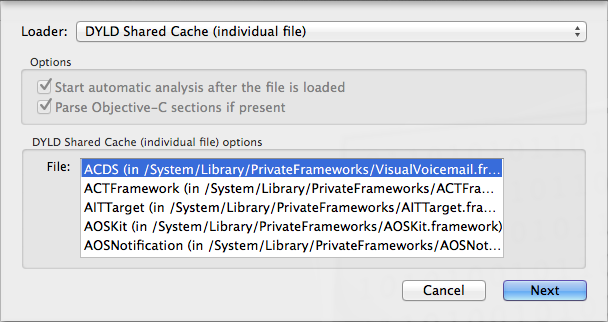

This extremely short guide is for iOS 7-9, both ARM32 and 64 bit Apple processors. The things you need to start:

* Mac with the latest version of [Hopper](http://www.hopperapp.com/) installed
* a jailbroken iOS device with OpenSSH installed

Let's start. Most of iOS system libs are sticked together in a DYLD shared cache (a big file mapped to a process address space). SSH your iOS device and 

```
# find / | grep dyld_shared_cache
```

For example, in iPhone 4 with iOS 7, you can find the DYLD shared cache here

```
/System/Library/Caches/com.apple.dyld/dyld_shared_cache_armv7
```

In iPad mini 2 with iOS 9, the caches are here

```
/System/Library/Caches/com.apple.dyld/dyld_shared_cache_arm64
/System/Library/Caches/com.apple.dyld/dyld_shared_cache_armv7s
```

(the iPad mini 2 runs ARM64, so there are two caches: for 32 and 64 bit modes).

Copy the cache from iOS device to a local Mac, open it with Hopper, and choose the library to disassemble:



Enjoy :)