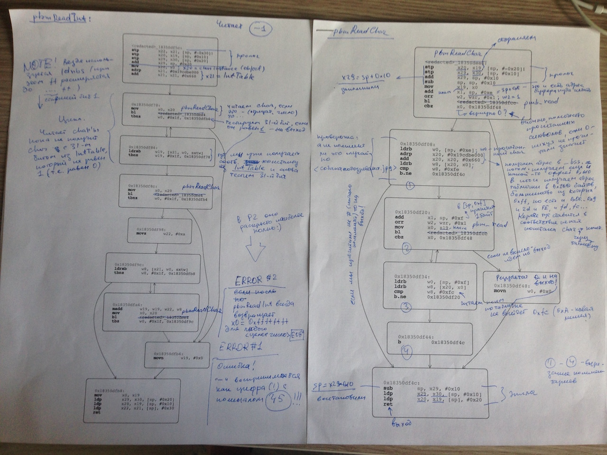
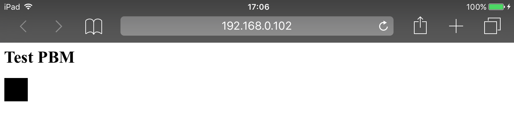

The research is kind of a geek joke for reverse engineers, please don't take it seriously.

# A quick word on Netpbm image formats

Netpbm formats are quite old image formats developed in the 1980s. However, the latest Safari browsers (Safari 9.1.1 on Mac and MobileSafari on iOS 9.x) still support them.

Here is a test example for your browser:


If you see a small (24x7 pixels) "FEEP" above, your browser supports Netpbm formats. If you see nothing, try to open this page with a desktop Safari on Mac or MobileSafari on iOS 9.x.

__UPDATE from Dec 10, 2017:__ The PBM image is not visible in the latest desktop/mobile Safari anymore. Maybe they canceled PBM support (it would be a smart move, BTW). ■

Netpbm image is a text file with `.pbm` extension. I'll not describe Netpbm formats in details, they are plaintext and quite simple. Please take 5 min to read the [Netpbm format](https://en.wikipedia.org/wiki/Netpbm_format) article in Wikipedia.

# `pbmReadInt(...)`

Let's consider a simple [portable graymap](https://en.wikipedia.org/wiki/Netpbm_format#PGM_example) image file:

```
P2		# a portable graymap image should start with P2
1 1		# image weigh and height (it's 1x1)
1		# maximum of grey between black and white
0		# the only pixel, it's black
```

The image is 1x1, the only pixel is black. MobileSafari on iOS 9.x process the image as follows:

1. The browser detects image type by calling `ImageIO:_CGImagePluginIdentifyPBM(...)`
2. Then it calls `ImageIO:_CGImagePluginInitPBM(...)` to detect the exact image type (it reads `P2` at the beginning of the file) and read its weigh, height, and a maximum of grey between black and white.
3. Finally, `ImageIO:copyImageBlockSetPBM(...)` is called to read the image pixel array (in our case, the only element in the array is `0`).

**Note!** If you wanna see the calls, open MobileSafari, open a tab, attach your debugger to a newly started `com.apple.WebKit.WebContent` process and breakpoint

```
ImageIO:_CGImagePluginIdentifyPBM
ImageIO:_CGImagePluginInitPBM
ImageIO:copyImageBlockSetPBM
```

I'd recommend to use a jailbroken iOS 9.x device [with LLDB](../2016-04-27-debugging-ios-binaries-with-lldb/). ■

As you see it, it was needed to read some integers, separated by spaces/tabs/newlines, from a plain text to parse the `.pbm` file above. So Apple designed a class, which represents a `.pbm` image file. The `ImageIO` binary does not contain symbols, therefore let's call the class `PBMFileObject`. The class has a dedicated method to read integers from a plain text. The method is `ImageIO:pbmReadInt(...)`, its prototype looks like

```
unsigned int32 PBMFileObject::pbmReadInt()
```

Every time we call `pbmReadInt(...)`, it returns the next integer from a `.pbm` file. The method contains a funny error.

# The error: a `-` char is a digit `45`

The `pbmReadInt(...)` in iOS 9.x implements a (very primitive) [finite-state machine](https://en.wikipedia.org/wiki/Finite-state_machine). It's based in the following table of 256 bytes (here is a memory dump from LLDB console on my iPad mini 2):

```
(lldb) mem read $x8 -c 0x100
0x19db6e660: ff ff ff ff ff ff ff ff ff fd fc ff ff fd ff ff  ????????????????
0x19db6e670: ff ff ff ff ff ff ff ff ff ff ff ff ff ff ff ff  ????????????????
0x19db6e680: fd ff ff fe ff ff ff ff ff ff ff ff ff 2d ff ff  ?????????????-??
0x19db6e690: 00 01 02 03 04 05 06 07 08 09 ff ff ff ff ff ff  ..........??????
0x19db6e6a0: ff ff ff ff ff ff ff ff ff ff ff ff ff ff ff ff  ????????????????
0x19db6e6b0: ff ff ff ff ff ff ff ff ff ff ff ff ff ff ff ff  ????????????????
0x19db6e6c0: ff ff ff ff ff ff ff ff ff ff ff ff ff ff ff ff  ????????????????
0x19db6e6d0: ff ff ff ff ff ff ff ff ff ff ff ff ff ff ff ff  ????????????????
0x19db6e6e0: ff ff ff ff ff ff ff ff ff ff ff ff ff ff ff ff  ????????????????
0x19db6e6f0: ff ff ff ff ff ff ff ff ff ff ff ff ff ff ff ff  ????????????????
0x19db6e700: ff ff ff ff ff ff ff ff ff ff ff ff ff ff ff ff  ????????????????
0x19db6e710: ff ff ff ff ff ff ff ff ff ff ff ff ff ff ff ff  ????????????????
0x19db6e720: ff ff ff ff ff ff ff ff ff ff ff ff ff ff ff ff  ????????????????
0x19db6e730: ff ff ff ff ff ff ff ff ff ff ff ff ff ff ff ff  ????????????????
0x19db6e740: ff ff ff ff ff ff ff ff ff ff ff ff ff ff ff ff  ????????????????
0x19db6e750: ff ff ff ff ff ff ff ff ff ff ff ff ff ff ff ff  ????????????????
```

In the binary, the table is called as `IntTable`. If we apply `IntTable` to a usual ASCII/ANSI table, we get

```
ANSCII/ANSI code      Byte from the table
-----------------     -------------------
00    NUL             ff
01    STX             ff
02    SOT             ff
03    ETX             ff
04    EOT             ff
05    ENQ             ff
06    ACK             ff
07    BEL             ff
08    BS              ff
09    HT              fd
0A    LF              fc
0B    VT              ff
0C    FF              ff
0D    CR              fd
0E    SO              ff
0F    SI              ff
10    DLE             ff
11    DC1             ff
12    DC2             ff
13    DC3             ff
14    DC4             ff
15    NAK             ff
16    SYN             ff
17    ETB             ff
18    CAN             ff
19    EM              ff
1A    SUB             ff
1B    ESC             ff
1C    FS              ff
1D    GS              ff
1E    RS              ff
1F    US              ff
20    [Space]         fd
21    !               ff
22    "               ff
23    #               fe
24    $               ff
25    %               ff
26    &               ff
27    '               ff
28    (               ff
29    )               ff
2A    *               ff
2B    +               ff
2C    ,               ff
2D    -               2d
2E    .               ff
2F    /               ff
30    0               00
31    1               01
32    2               02
33    3               03
34    4               04
35    5               05
36    6               06
37    7               07
38    8               08
39    9               09
3A    :               ff
3B    ;               ff
3C    <               ff
3D    =               ff
3E    >               ff
3F    ?               ff
40    @               ff
...all remaining ASCII/ANSI codes are ff
```

In fact, the table above marks ASCII/ANSI codes:

```
; Separators:
fd: 09 (Tab)		
	13 (Return)
	20 (Space)
	
; Comments:
fe: 23 (#)				; start comment

; New line
fc: 0A (New line)		; a new line (also, it's end of a comment)
	
; A minus (note it, it's important!)
2d: 2d (-)
	
; Digits:
00-09: 0-9 (decimal digits from zero to nine)
	
; Shouldn't happen outside comments:
ff: ...
```

`pbmReadInt(...)` does the job as follows, step by step:

1. At the very beginning, set the result to `0`.

2. Call `ImageIO::pbmReadChar(...)` to read a single char from a `.pbm` file.

  **Note!** `pbmReadChar(...)` reads the char, then check the `IntTable`. If the char code is `fe` (it's a comment start `#`), `pbmReadChar(...)` start reading next chars one by one. `pbmReadChar(...)` checks char codes in `IntTable` and just skips the chars until `fc` is faced (a new line, end of the comment). So `pbmReadChar(...)` always skips comments. ■

3. Use `IntTable` to check the char:

  * for `fd` or `fc`:

        * if the previous char was not a digit, just skip it and read next char (go to the previous step)
        * if the previous char was a digit, exit `pbmReadInt(...)` and return the result

  * `ff`, something goes wrong, the char should not appear outside a comment, `pbmReadInt(...)` exits with error code `0xffffffff`.

    * `00`...`09` is a digit (`00` is "zero", `01` is "one", etc). Go to the next step.
    * `2d` (a "minus" char) is also... a digit! It's stupid, but anyway go to the next step.

4. If the char is a digit (a "minus" char is also considered as a digit), use `IntTable` to transform char to an integer:

    * for `0x30`, `0x31`, ..., `0x39` ASCII chars we have `0`, `1`, ..., `9` correspondignly
    * for `0x2d` ASCII char we have... the integer `45`!

    Then add the integer to the result

    ```
    <result> = <result> * 10 + <the integer>
    ```

    and go to step 2.

**Note!** I've explained the `pbmReadInt(...)` code logic in a (more or less) simple way. I made no references to `pbmReadInt(...)` machine code at all, but reversing the code took some time for me :)



■

As we see it, `pbmReadInt(...)` considers the `-` char as a digit of value `45`. Obviously, it's an error, but... why don't we use it for fun? :)

# The Portable Bitmap Minus format

Ok, what if we use _only_ "munis" chars in `.pbm` file? No decimal digits, no comments, no newlines, but only "munises" and spaces. To be more precise:

1. A `.pbm` file starts with `P2`
2. Further, the file format is the same as the [portable graymap format](https://en.wikipedia.org/wiki/Netpbm_format#PGM_example), but we only allowed to use `-` and spaces.
3. As result, we can use only `45`-based integers: `-` is `45`, `--` is `45+45*10=495`, `---` is `45+45*10+45*100=4995` etc.
4. The results should be viewed with MobileSafari on iOS 9.x device :)

I'd call such error-based format a "Portable Bitmap Minus" format, he-he... :)

Ok, let's try! Here is (probably, the simplest) example `test.pbm`. Here is a black square 45x45 pixels:

```
P2 - - - -
```

Insert the image in HTML page

```
<html>
<head><title>Test exotic formats</title></head>
<body>
	<h1>Test PBM</h1>
	
</body>
</html>
```

and load with MobileSafari. It looks like:



Well, it works! We see a black square. Malevich should be proud :) I'd like to draw something more beautiful that just a black square, but I'm a crappy artist.

So it goes.

**P.S.** If I try to open the black-square example above in my desktop Safari, it stuck and stop responding... :) It wold be interesting to look inside `pbmReadInt` on desktop. Ha-ha!..