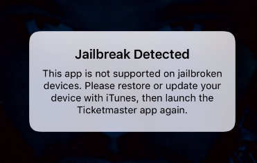
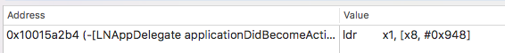

In the blog post, we bypass [TicketMaster](https://itunes.apple.com/us/app/ticketmaster/id500003565) jailbreak detection. It works for TicketMaster 1.23.0 (the laters version in AppStore for Nov 11, 2017). Maybe it will work for future versions as well, but it's not for sure.

If we start Ticket Master 1.23.0 on a jailbroken iOS device, we see 



Let's bypass it.

# Research

Ok, lets do a quick research. Install the app from AppStore and decrypt the app binaries. Disassemble the main binary `Ticketmaster` and search for the string `"Jailbreak Detected"` in `__DATA.__cfstring` section. It looks like

```
cfstring_Jailbreak_Detected:
0x0000000102e2a218 dq ___CFConstantStringClassReference, 0x7c8, aJailbreakDetec, 0x12 ; "Jailbreak Detected", DATA XREF=-[LNAppDelegate showWonderfulDeviceAlert]+1852
```
Note the xref, it points to the ObjC method  `-[LNAppDelegate showWonderfulDeviceAlert]` (they think jailbroken iPhones are "wonderful devices", so cute). Jump the xref and look at the method. It's "flat", no code branches inside, so it can not "decide" to show the jailbreak detected alert or not. We need to go ~~deeper~~ up and find the method which calls `-[LNAppDelegate showWonderfulDeviceAlert]`.

The only xrefs pointing to `-[LNAppDelegate showWonderfulDeviceAlert]` is



In the code of `-[LNAppDelegate applicationDidBecomeActive:]`, we see

```
; call +[UIDevice isWonderful], put the result to x0
0x00000001001599d4 ldr  x1, [x8, #0x940] ; argument "selector" for method imp___stubs__objc_msgSend, "isWonderful",@selector(isWonderful)
0x00000001001599d8 bl   imp___stubs__objc_msgSend ; objc_msgSend
```

Then it checks `w0` and makes decision to show the jailbreak detected alert, or not:

```
; if w0 == 0 (no jailbreak detected), jump to 0x0000000100159de8 and go on
0x0000000100159de4 cbz  w0, loc_10015a2d8
; if w0 == 1 (jailbreak detected), show the alert:
0x0000000100159de8 adrp x8, #0x10321e000
...
0x000000010015a2b0 adrp x8, #0x103008000 ; &@selector(setTintColor:)
0x000000010015a2b4 ldr  x1, [x8, #0x948] ; argument "selector" for method imp___stubs__objc_msgSend, "showWonderfulDeviceAlert",@selector(showWonderfulDeviceAlert)
0x000000010015a2b8 ldr  x19, [sp, #0x10]
0x000000010015a2bc mov  x0, x19 ; argument "instance" for method imp___stubs__objc_msgSend
0x000000010015a2c0 bl   imp___stubs__objc_msgSend ; objc_msgSend
```

After a quick look, the method  `+[UIDevice isWonderful]` appears in the private framework `TicketmasterUtilities`. Disassemble the binary `TicketmasterUtilities` and look at `+[UIDevice isWonderful]`. It's easy to see that the method is just a stub to call another code which checks some jailbreak-related stuff. Here is actually the code:

```
 ___34+[UIDevice(Wonderful) isWonderful]_block_invoke:
0x000000000002c1ec sub sp, sp, #0x50              ; Objective C Block defined at 0x613f0, DATA XREF=0x61400
...
; is Cydia installed? (if it is, the device is jailbroken)
0x000000000002c22c ldr x21, #0x77c18              ; @selector(fileExistsAtPath:)
0x000000000002c230 adr x2, #0x64ed0               ; @"/Applications/Cydia.app"
0x000000000002c234 nop
0x000000000002c238 mov x1, x21                    ; argument "selector" for method imp___stubs__objc_msgSend
0x000000000002c23c bl  imp___stubs__objc_msgSend  ; objc_msgSend
0x000000000002c240 cbz w0, loc_2c250
...
; is MobileSubstrate installed? (if it is, the device is jailbroken)
0x000000000002c264 mov x22, x0
0x000000000002c268 adr x2, #0x64ef0               ; @"/Library/MobileSubstrate/MobileSubstrate.dylib"
0x000000000002c26c nop
0x000000000002c270 mov x1, x21                    ; argument "selector" for method imp___stubs__objc_msgSend
0x000000000002c274 bl  imp___stubs__objc_msgSend  ; objc_msgSend
...
; try to create /private/wonderful.txt and write "This is a test." to the file
; (if it's possible, the device is jailbroken)
0x000000000002c2a4 ldr x1, #0x77c20               ; argument "selector" for method imp___stubs__objc_msgSend, @selector(writeToFile:atomically:encoding:error:)
0x000000000002c2a8 adr x0, #0x64f10               ; argument "instance" for method imp___stubs__objc_msgSend, @"This is a test."
0x000000000002c2ac nop
0x000000000002c2b0 adr x2, #0x64f30               ; @"/private/wonderful.txt"
...etc
```

If all checks are passed, the application does not show the jailbreak detected alert. 

# Bypassing

It's easy. Let's hook `+[UIDevice isWonderful]` and make it returning `0` in any case (make jailbroken devices ~~great~~ not "wonderful" again :)). Here is a simple [Frida](https://www.frida.re) script:

```
/*
    bypass_jb_tm.js
    ---------------
    The script bypasses TicketMaster 1.23.0 jailbreak detection
    Created 2017-11-09 by Dima Kovalenko (kov4l3nko@gmail.com)
    Tested with Frida 10.6.21 and TicketMaster 1.23.0 on 64bit iOS devices
*/

// Resolve the address of +[UIDevice isWonderful]
var resolver = new ApiResolver('objc');
var matches = resolver.enumerateMatchesSync("+[UIDevice isWonderful]");
if (matches.length > 0 ) {
    // The address found, set a hook
    Interceptor.attach(matches[0]["address"], {
        onLeave: function(retval) {
            // Always return 0
            retval.replace(0);
        }    
    });
    console.log("SUCCESS! +[UIDevice isWonderful] hooked!");
} else {
    // The address not found
    console.log("ERROR! Can't find the address of +[UIDevice isWonderful]");
}
```

With the script, we can run the TicketMaster on a jailbroken device. Just connect the iOS device to your Mac via USB and run in your Mac console:

```
$ frida -U --no-pause -f com.ticketmaster.ios.TicketmasterApp -l bypass_jb_tm.js
```
Of course, Frida must be installed on your Mac and iOS device, `bypass_jb_tm.js` must be in the current dir.