# Intro

Here we discuss some C/C++ programming basics for jailbroken iOS devices (on non-jailbroken devices, command line tools are not useful because iOS console is unavailable, DYLIBs are replicated with private frameworks). First, we write a command line tool, then a DYLIB.

# The sandbox

Let's prepare a sandbox to play in.

## Environment

We need the latest MacOS Sierra and XCode. Also, we need a jailbroken iOS device.

This guide was tested with

1. MacBook Air 2015, MacOS Sierra 10.12.4, XCode 8.3.2
2. iPad mini 2 with iOS 9.0.2 + Pangu9 jailbreak
3. iPad mini 2 with iOS 10.1.1 + Yalu jailbreak

---

__Note!__ In fact, the way to create command line tools / DYLIBs for iOS, described below, is a hack. Therefore I can't guarantee it will work in your environment correctly.

---

## Apple certificate

To compile our DYLIBs in XCode and sing they with Apple-signed certificate, we need an Apple developer account. 

Login to XCode with an Apple ID and create an iOS developer certificate:

1.  Start XCode and choose "Preferences" from the main menu

    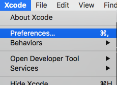

2. Choose "Account", then choose "+", "Add Apple ID..."

    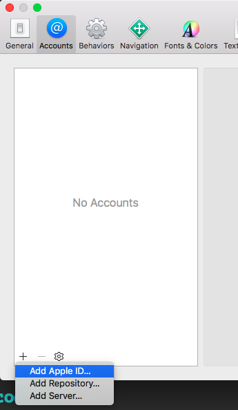 

3. Type login/password and click "Sign In"

    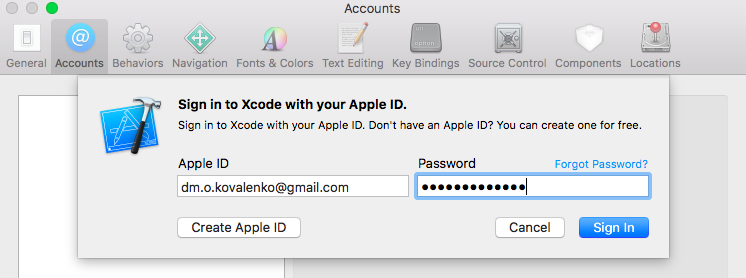

4. Choose "Manage Certificates..."

    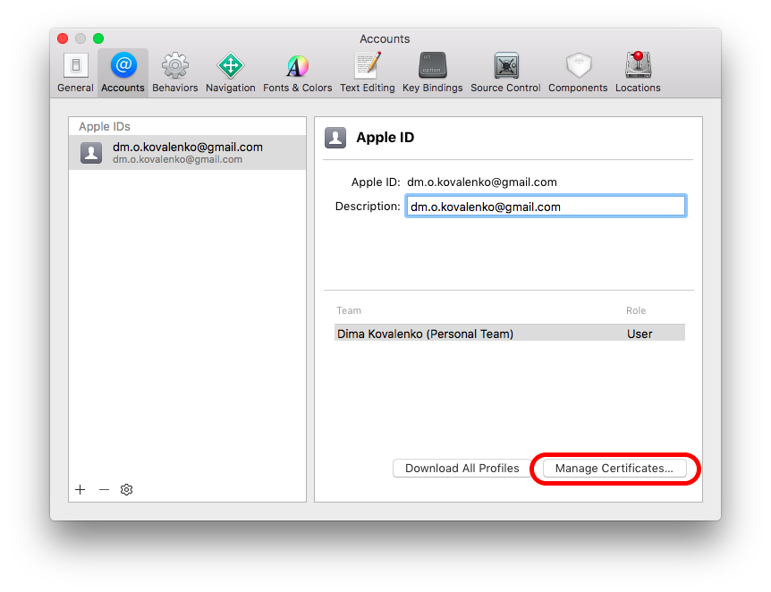

5. Then choose "+" and "iOS Development". Wait...

    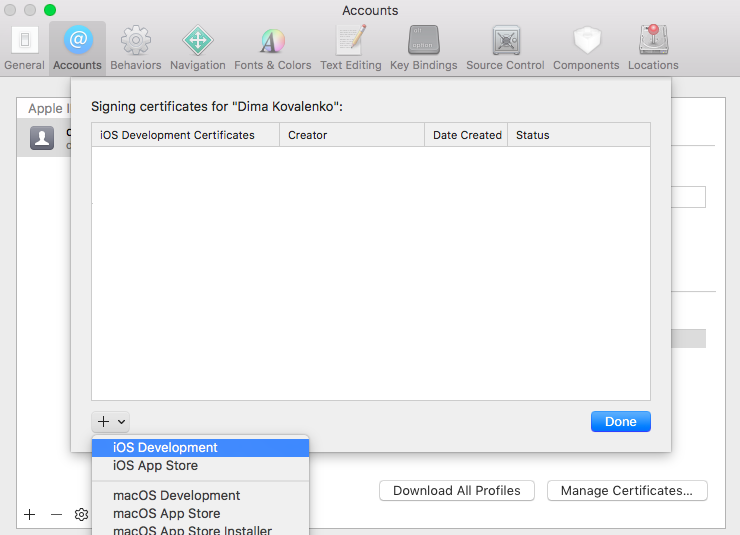

6. As result, the newly created certificate should appear in the list:

    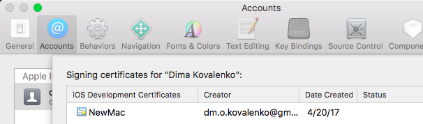

---

__Note!__ At the moment, it's not clear how to compile/sign command line tools for iOS with XCode "right from the box". Maybe some unofficial "extensions" may help, e.g. [iOSOpenDev](http://iosopendev.com).

---

## Self-signed certificate

We compile a command line tool code with Makefile and sing the resulting binaries with a self-signed certificate. To generate the certificate, follow the instruction below.

1. Start Keychain Access (the app comes with MacOS in `/Applications/Utilties/Keychain Access`), choose "Keychain Access", "Certificate Assistant", "Create a Certificate...":

    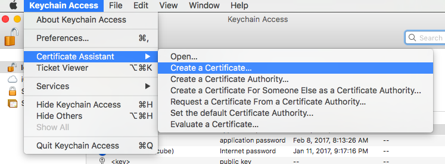

2. Name the certificate, e.g. "codesign". Make sure the Identity Type is “Self Signed Root” and the Certificate Type is “Code Signing”. We don’t need to check the “Let me override defaults” unless we want to change other properties on the certificate (name, email, etc). Choose "Create", "Continue", and "Done":

    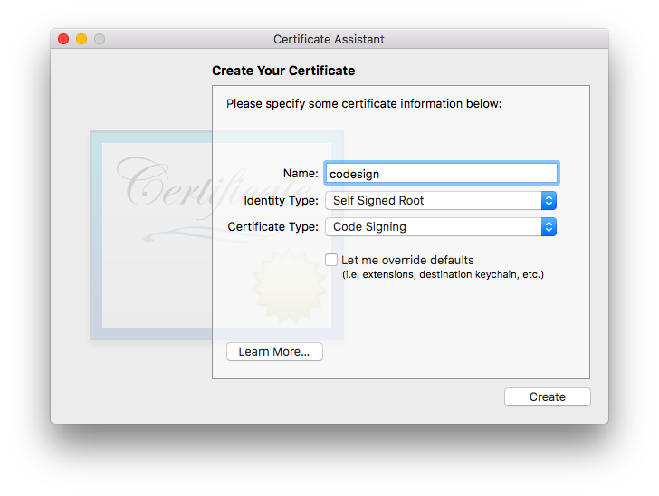
    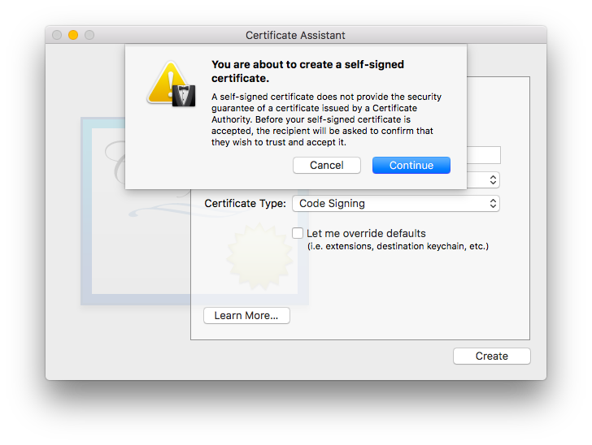
    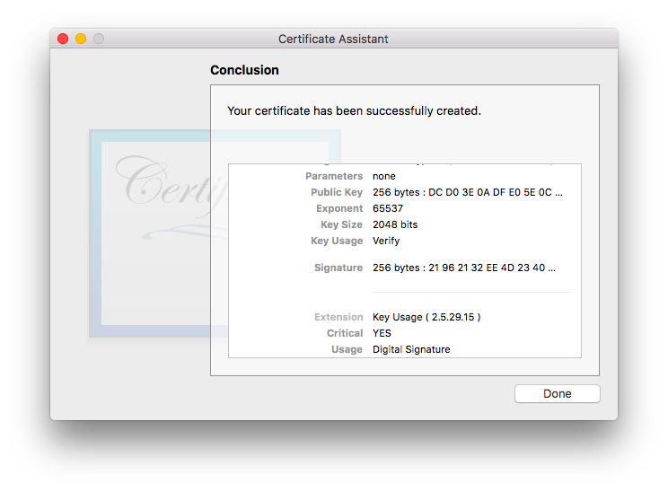

3. In MacOS terminal, run

    ```
    $ security find-identity -pcodesigning
    ```

    Check output, it should look like

    ```            
    Policy: Code Signing
    Matching identities
        1) 34DD260923F78F59204C3282F99F3314EFDA7395 "iPhone Developer: dm.o.kovalenko@gmail.com (6FU2JFWVAH)"
        2) BE79FC565230EBC907DB74E8219684104F0C8347 "codesign" (CSSMERR_TP_NOT_TRUSTED)
           2 identities found

    Valid identities only
    1) 34DD260923F78F59204C3282F99F3314EFDA7395 "iPhone Developer: dm.o.kovalenko@gmail.com (6FU2JFWVAH)"
      1 valid identities found            
    ```

    Find our certificate by name (we named it "codesign", remember?):​
    ```            
    BE79FC565230EBC907DB74E8219684104F0C8347 "codesign" (CSSMERR_TP_NOT_TRUSTED)            
    ```


Remember or write out the identity's 40 character hex string (here it's `BE79FC565230EBC907DB74E8219684104F0C8347`), we will need it for signing executables.

# Command line tool

A quick word about command line tools.

## XCode project

Just create a command line tool XCode project:

1. Start XCode, choose "Create a new Xcode project":

    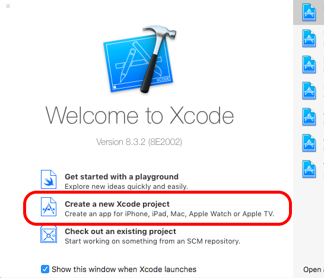

2. Choose "macOS" (there is no command line tool option for iOS, so we choose "macOS"), then choose "Command Line Tool" and click "Next":

    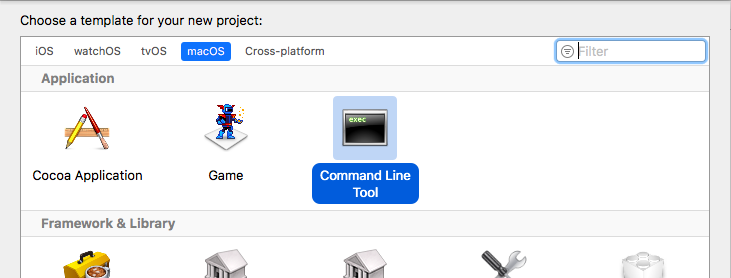

3. Fill all fields on the next screen and click "Next":

    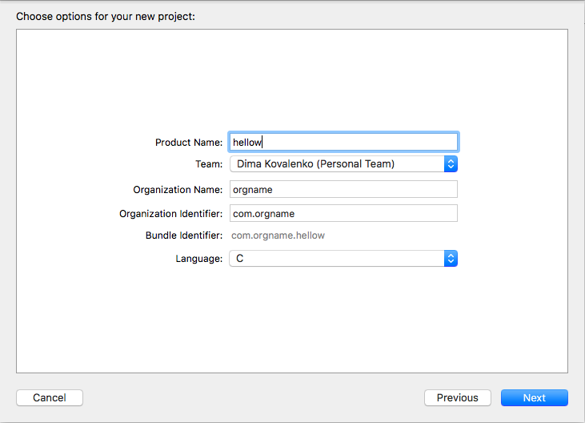

4. Choose a project location and click "Create":

    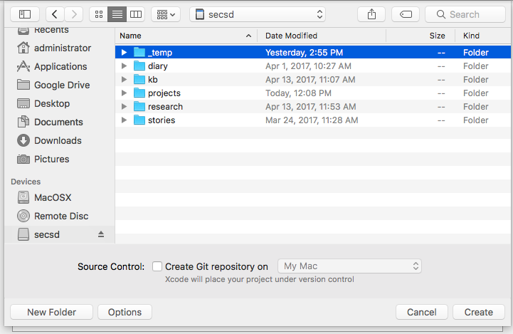

5. Finally, we write C/C++ code with Xcode IDE.

---

__Note!__ If the code (or, at least, some of it's parts) is not platform specific, we may consider testing it on MacOS, without iOS devices.

---

## Compilation for iOS from command line or Makefile

---

__Note!__ As it was noted above, at the moment, it's not clear how to compile/sign command line tools for iOS with XCode "right from the box". Maybe some unofficial "extensions" may help, e.g. [iOSOpenDev](http://iosopendev.com).

---

A minimal Makefile for sources containing single `main.c` file:

```
# Path to GCC compiler
GCC_BIN=`xcrun --sdk iphoneos --find gcc`

# Path to iOS SDK (XCode must be installed)
SDK=`xcrun --sdk iphoneos --show-sdk-path`

# Arch. list (remove unnecessary arches)
ARCH_FLAGS=-arch armv7 -arch armv7s -arch arm64

# The identity's 40 character hex string (see above)
CER=BE79FC565230EBC907DB74E8219684104F0C8347

# Loader flags. Just remove/add unnecessary/neccessary -frameworks and -l (libs)
LDFLAGS = \
	-F$(SDK)/System/Library/Frameworks/\
	-F$(SDK)/System/Library/PrivateFrameworks/\
	-framework UIKit\
	-framework CoreFoundation\
	-framework Foundation\
	-framework CoreGraphics\
	-framework Security\
	-lobjc\
	-lsqlite3\
	-bind_at_load

# GCC compiler options for ARM
GCC_ARM = $(GCC_BIN) -Os -Wimplicit -isysroot $(SDK) $(ARCH_FLAGS)

# Compile mail.o -> hellow (the final binary)
default: main.o
	@$(GCC_ARM) $(LDFLAGS) main.o -o hellow

# Compile mail.c -> main.o
main.o: main.c
	$(GCC_ARM) -c main.c

# Sign the final binary with the certificate (see above)
sign:
	codesign -fs "$(CER)" hellow
```

If we see a warning(s) like this

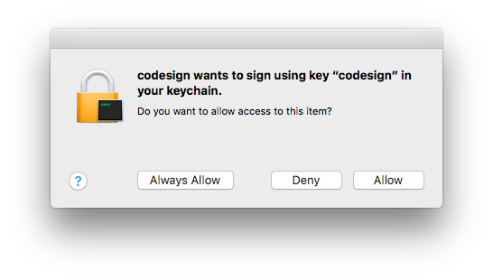

we just need to click "Allow" or, if we don't want to click "Allow" every time, choose "Always Allow".


To grant the binary some special permissions, we should create `entitlements.xml`. For example, to gran access to iOS keychine, an entitlements file may look like follows:

```
<?xml version="1.0" encoding="UTF-8"?>
<!DOCTYPE plist PUBLIC "-//Apple//DTD PLIST 1.0//EN" "http://www.apple.com/DTDs/PropertyList-1.0.dtd">
<plist version="1.0">
	<dict>
		<key>keychain-access-groups</key>
		<array>
			<string>*</string>
		</array>
	</dict>
</plist>
```

Then the sign section of Makefile will look like

```
# Sign the final binary with the certificate (see above)
sign:
	codesign -fs "$(CER)" --entitlements entitlements.xml  hellow
```

Then we should just copy the signed binary to your iOS device, e.g. to `/usr/bin/`. Finally, ssh our iOS device and grant `x` permissions:

```
$ chmod a+x <path_to_you_binary>
```

e.g.

```
$ chmod a+x /usr/bin/hellow
```

# DYLIB

## XCode project

To create a project:

1. Run XCode
2. Choose "Create a new XCode project"
3. Choose "macOS", then "Library", then click "Next"
4. Set "Framework" to "None (Plain C/C++ Library)", "Type" to "Dynamic". Fill other fields with product/organization names and product identifier. Click "Next"
5. Choose a folder to store the project and click "Create..."

Now, customize the project:

1. Click project root, then "Build Settings", choose "All", then change "Base SDK" to "iOS 10.1"

    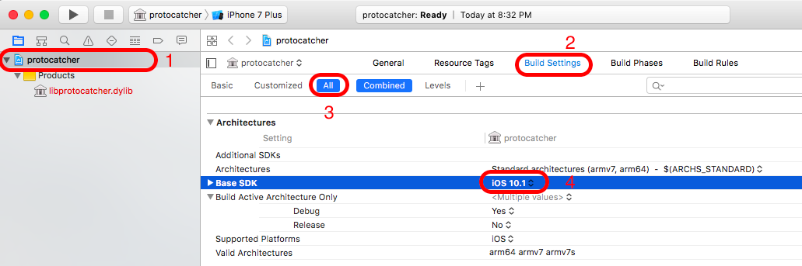

2. Click project root, then "General", then set "Deployment target" to a valid iOS version (it's 9.0 in our sandbox) and "Device" to "Universal"

    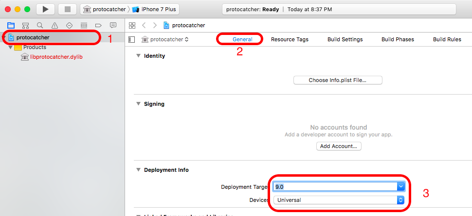

3. Also, if you see "No account found" here, click "Add account":

    

    Then enter your Apple ID login/password and click "Sign In" button. Consider enabling "Automatically manage signing". As result, the settings should looks like:

    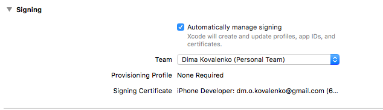

4. Click the project name at the top and choose "Generic iOS device" scheme:

    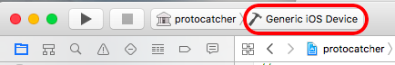

5. In the main menu, choose "File" => "Project Settings...". Specify "Derived Data" as "Project-relative Location".

Now, you can build your DYLIB with XCode in a usual way.

## The `test(..)` function skeleton

Add C file and corresponding header to the project root:

1. Open a context menu on the project root and choose "New file..." => "C File". Click "Next"
2. Specify C file's name, e.g. `protocatcher`. Make sure "Also create a header file" set. Click "Next".
3. Specify a files location and click "Create"

Now, time to write a skeleton. We are going to hook `objc_msgSend(...)`, so add to `protocatcher.c`:

```
#include "protocatcher.h"

EXPORT int test(id obj, SEL op) {
	// Write something useful here, e.g. obj_msgSend hooks :)
	return 0;    
}
```

and to `protocatcher.h`:

```
#ifndef protocatcher_h
#define protocatcher_h

#include <stdio.h>
#include <objc/runtime.h>
#include <objc/message.h>

// Symbolic name for visibility("default") attribute.
#define EXPORT __attribute__((visibility("default")))

EXPORT int test(id obj, SEL op);

#endif /* protocatcher_h */
```

## Loading a lib with LLDB

To load the lib, just type in LLDB console:

```
expr (void)dlopen("/var/mobile/Containers/Bundle/Application/5EB17F26-965A-4B53-B927-62148DF0BDCE/Badoo.app/libprotocatcher.dylib",0x0002)
```

where

* `/var/mobile/...blah-blah-blah.../libprotocatcher.dylib` is a full path to `libprotocatcher.dylib`
* `0x0002` means "load now!"

# Links

1. [Keychain Dumper on GitHub](https://github.com/ptoomey3/Keychain-Dumper) (see README and Makefile)

