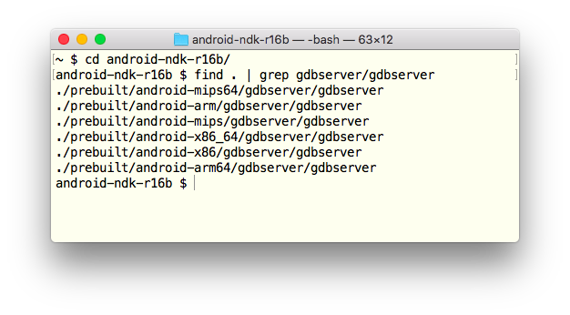
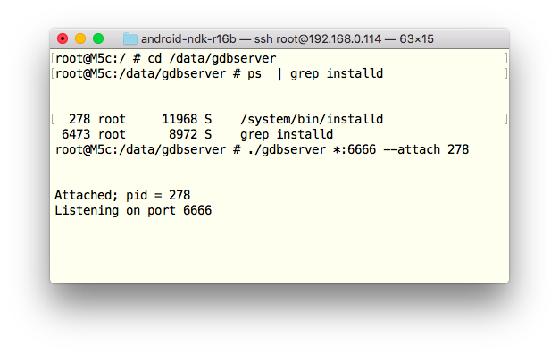
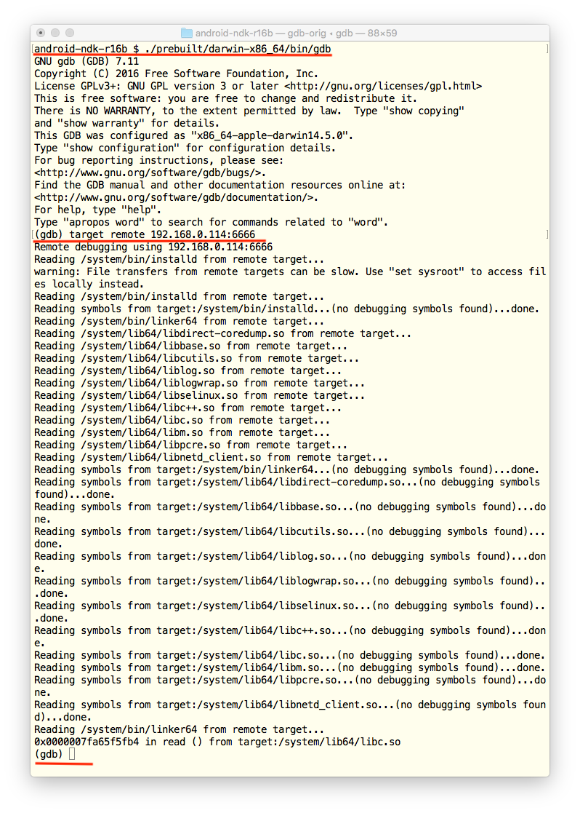

This guide is a part of the series about third-party Android code debugging:

* Debugging third-party machine code in Android _(the guide you are reading now)_
* [Debugging third-party Android Java code on OS X](../2018-01-20-debugging-thirdparty-android-java-code)
* [Debugging third-party Android app code from the very beginning](../2018-01-23-debugging-android-apps-from-first-instruction)
* [Debugging Android third-party Java apps with native methods](../2018-01-25-debugging-mixed-android-code/)

It's a very simple guide, it can be "compressed" to a single sentence: 

> Copy `gdbserver` from Android NDK to a rooted Android device via SSH, attach it to a running process and enjoy remote debugging with GDB.

If it's enough for you, just stop reading this and start debugging. If you need more details, read the guide below :) Also, there is [a good guide](https://packmad.github.io/gdb-android/) from [@packm4d](https://twitter.com/packm4d), read it as well.

# Prerequisites

This is what we need to start:

* A rooted Android device. To be more precisely, we need a device running Android of version 5 or higher. Also,
    
	* BusyBox and SuperSU must be installed and work properly;
	* `adb shell su` must give us a root shell `#` .

    Other rooted Android features, e.g. running `adbd` on the device as root, are not really necessary.

* We need a Mac with the latest OS X.

---

**Note!** `gdb` and `gdbserver` are also available for Windows and Linux, so the guide (with some minor changes) is probably applicable to Windows and Linux as well.

---

# Preparations

Preparations are easy, just three simple steps:

1. First of all, we install [SSHDroid](https://play.google.com/store/apps/details?id=berserker.android.apps.sshdroid&hl=uk) on the Android device, run the app, allow root access and test SSH connection from the Mac to the device.

2. Then, if the latest Android NDK is not installed on the Mac, we install it. We need it to get `gdbserver` for our Android CPU architecture and bitwise. Usually, it's located in `<Android NDK directory>/prebuilt/android-<architecture and bitwise>/gdbserver/`:
	
	

	E.g. for Android device with AMR64 processor, we choose  `<Android NDK directory>/prebuilt/android-amr64/gdbserver/gdbserver`.

3. Finally, we use `scp` to copy `gdbserver` to `/data/gdbserver/` on the Android device (if `/data/gdbserver/` does not exist, create it with SSH). We place `gdbserver` under `/data` because `/data` is writable on almost all Android devices, even if `adbd` does not run as root and `adb root` fails with "adbd cannot run as root in production builds" message.

That's it.

# It's all ready

Let's connect GDB to an Android demon, for example, to `installd`:

1. Connect the Mac and Android device to the same WiFi network

2. On the Mac, SSH the Android device and find the demon we want to debug (for example, `installd`) with `ps` command, then go to `/data/gdbserver` and run `./gdbserver *:6666 --attach <PID of installd>`. In my console it looks like

	

3. On the Mac, run `gdb` (on OS X, it's located in `<Android NDK directory>/prebuilt/darwin-x86_64/bin/gdb`) and execute `target remote <the Android device IP>:6666` in GDB console. As result, we get something similar to

	

In the same way, we can debug native code from `.so` libs of running Android applications.

---

__Note!__ If you do not see symbols in loaded modules, try the following:

* Create a local directory on your Mac, e.g. `local_sys_copy` and copy `/system/lib` (`/system/lib64` for 64-bit devices) from your Android device to the local directory. If you debug a Java application with native methods, copy application's `.so` libraries to the local directory as well.
* In GDB console, run

	```
	(gdb) set solib-search-path path/to/your/local_sys_copy/
	```

	In most cases, GDB reads the `.so` libs from the local directories and loads the symbols, so you can set breakpoints on function names, find function addresses by names etc.

---