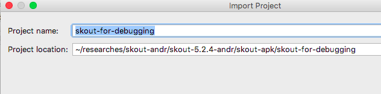
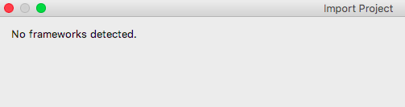
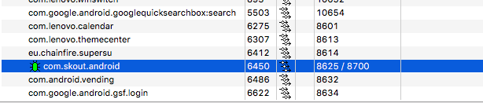

This guide is a part of the series about third-party Android code debugging:

* [Debugging third-party machine code in Android](../2018-01-16-debugging-machine-code-android/)
* Debugging third-party Android Java code on OS X _(the guide you are reading now)_
* [Debugging third-party Android app code from the very beginning](../2018-01-23-debugging-android-apps-from-first-instruction)
* [Debugging Android third-party Java apps with native methods](../2018-01-25-debugging-mixed-android-code/)

There is [a very detailed article](https://crosp.net/blog/android/android-reverse-engineering-debugging-smali-using-smalidea/) from [@CR0SP](https://twitter.com/CR0SP) about debugging third-party Android Java code on Windows. It's great and I'd recommend you to read it first, especially if you use Windows. Also, there is [another guide on debugging third-party Java code](https://packmad.github.io/debug-smali/), please read it as well.

In this blog post we are talking about similar things considering specificity of OS X.

# Prerequisites

You need a Mac and an Android device with "USB debugging" options enabled. The device may be or may not be rooted, it doesn't matter.

# Preparations

On the Mac,

1. Install the latest [Android Studio](https://developer.android.com/studio/index.html). After installation, check Android Studio settings ➡ Appearance & Behavior ➡ System Settings ➡ Android SDK ➡ SDK Tools ➡ Android SDK Platform Tools. The Android SDK Platform Tools must be installed.

2. Make sure that Android Device Monitor (DDMS) works properly with your Android device. Run

	```
	$ ~/Library/Android/sdk/tools/monitor
	```
	
	If it crashes with an error or stuck on start, try to downgrade JDK on the Mac (see Tip #1 below for details). On my Mac, running OS X High Sierra 10.13.2, Android Device Monitor works with JDK 1.8.0\_141 or lower; it fails with JDK > 1.8.0\_141. You can find old JDKs in [the Oracle archive](http://www.oracle.com/technetwork/java/javase/archive-139210.html) (Oracle account may be needed to download). 
	
	Also, Android Device Monitor may not work properly because of the Android device you use. E.g. on my Meizu M5c it starts, but doesn't show apps ("Devices" and "Threads" tabs are empty). It looks like a device-specific problem, at the moment I don't know how to fix it without flashing the device with a custom ROM. So if you face something similar, try another Android device.

3. [Download the latest JAR's for smali and baksmali](https://bitbucket.org/JesusFreke/smali/downloads/) and place to any suitable directory. Consider creating shell wrappers (see Tip #2 below for details).

4. [Download the latest smalidea archive](https://bitbucket.org/JesusFreke/smali/downloads/) and install it to Android Studio (just follow [the instruction "Installation" section](https://github.com/JesusFreke/smali/wiki/smalidea)).

5. Install 7zip (install [Homebrew](https://brew.sh) and then run `brew install p7zip` in OS X Terminal).

No need to prepare your Android device in some special way, just make sure it works with Android Device Monitor (see step 2 above).

**Tip #1.** If you want to remove the current version of JDK, run

```
$ /usr/libexec/java_home -V
```

It will print the JDK's home directory, e.g.

```
Matching Java Virtual Machines (1):
    9.0.1, x86_64:	"Java SE 9.0.1"	/Library/Java/JavaVirtualMachines/jdk-9.0.1.jdk/Contents/Home
```

Remove the JDK home directory (`/Library/Java/JavaVirtualMachines/jdk-9.0.1.jdk/` in the example above). If it doesn't help, also remove

```
$ sudo rm -rf /Library/PreferencePanes/JavaControlPanel.prefPane
$ sudo rm -rf /Library/Internet\ Plug-Ins/JavaAppletPlugin.plugin
$ sudo rm -rf /Library/LaunchAgents/com.oracle.java.Java-Updater.plist
$ sudo rm -rf /Library/PrivilegedHelperTools/com.oracle.java.JavaUpdateHelper
$ sudo rm -rf /Library/LaunchDaemons/com.oracle.java.Helper-Tool.plist
$ sudo rm -rf /Library/Preferences/com.oracle.java.Helper-Tool.plist
```

Done. ★

**Tip #2.** Consider adding the folder where you placed the smali/baksmali JAR's, to PATH, and creating simple shell script wrappers for the JAR's. Here is an example for `smali-2.2.2.jar`:

```
#!/bin/sh

BASEDIR=$(dirname "$0")
java -jar "$BASEDIR/smali-2.2.2.jar" "$@"
```

So you just type `smali.sh` in Terminal, instead of annoying `java -jar <path/to/>smali-2.2.2.jar`. Anyway, further in the guide, I will use `smali.sh` and `baksmali.sh` wrappers for the JAR's. ★

# How to debug APK

For example, let's debug Java code of [Skout](https://play.google.com/store/apps/details?id=com.skout.android&hl=uk):

1. **Get the original APK.** For Skout (as well as for any app, installed from Google Play), you can just copy the APK from the Android device with `adb pull`:

	```
	$ adb pull /data/app/com.skout.android-1/base.apk ./
	$ mv base.apk com.skout.android-original.apk
	```
	
2. **Baksmali DEX classes from the original APK.** Run on your Mac:

	```
	$ mkdir -p skout-for-debugging/smali-src
	$ 7z e com.skout.android-original.apk classes*.dex
	$ for c in classes*.dex; do baksmali.sh d $c -o ./skout-for-debugging/smali-src; done
	```
	
3. **Create an Anroid Studio project.** Run Android Studio and choose in the main menu: "File" ➡ "New" ➡ "Import Project". Choose the `skout-for-debugging/` directory created at the previous step:

	
	
	Click "Open". Then choose "Create project from existing sources":
	
	
	
	Click "Next". On the next step, check if the "Project location" path is correct (it must point to your `skout-for-debugging/` directory):
	
	
	
	Click "Next". Wait while Android Studio is inspecting the directory, then make sure that `skout-for-debugging` directory is checked:
	
	
	
	Click "Next". Wait while Android Studio is looking for appropriate frameworks (**spoiler**: it will not find any). Get the message
	
	
	
	and click "Finish". Wait while Android Studio is indexing files, then, in the left panel, choose "Project ➡ Project Files":
	
	
	
	Mark the `skout-for-debugging/smali-src/` directory as the sources root:
	
	
	
	The Android Studio project created.
	
4. **Create a remote configuration**. In the main menu of Android Studio, click "Run" ➡ "Edit Configurations..." ➡ "+" ➡ "Remote":

	
	
	On "Configuration tab", change "Port" to `8700`:
	
	
	
	Re-name the configuration, if you want (change the "Name" field). In this example, we will leave it "Unnamed". 
	
	Click "OK".
	
5. **It's time for Android Device Monitor**. Connect your Android device to the Mac via USB, run the app on your Android device, run Device Monitor on your Mac, and choose the app on the "Devices" tab:

	
	
6. **Run debugging**. Switch back to Android Studio. In the main menu, click "Run" ➡ "Debug 'Unnamed'" (here "Unnamed" is the name of the remote configuration we created on step 4 above, remember?). As result, Android Studio must say 

	> Connected to the target VM, address: 'localhost:8700', transport: 'socket'
	
	in its console:

	
	
	Also, the app must be marked with a green bug icon in Android Device Monitor:
	
	
	
**Note!** Alternatively, you can run Android Monitor _before_ you create the remote configuration, look at the first port number


and use it in the remote configuration instead of `8700`. ★

Now you can set breakpoints in Dalvik code, trace Dalvik instructions, inspects registers etc.