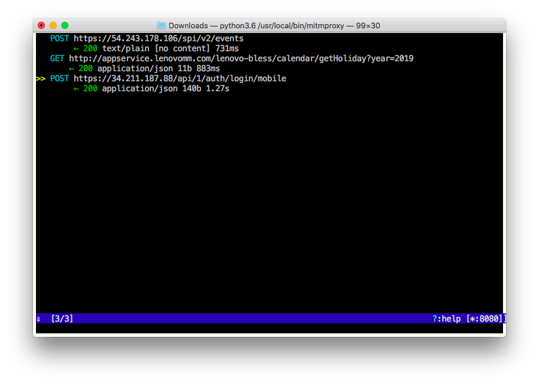
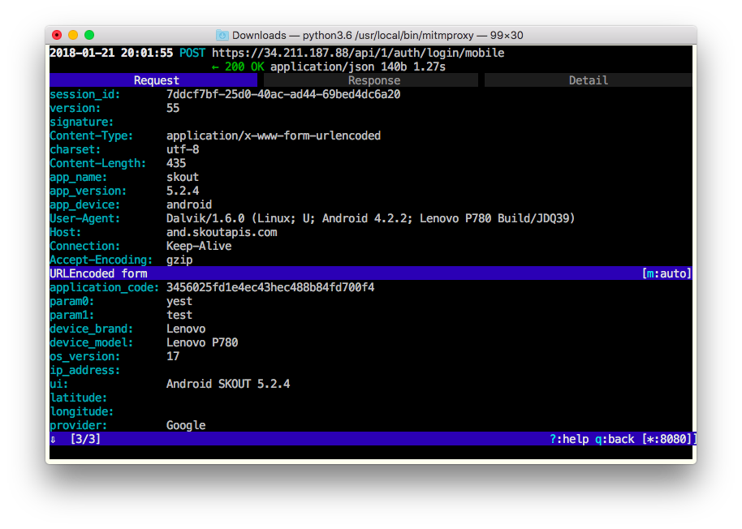
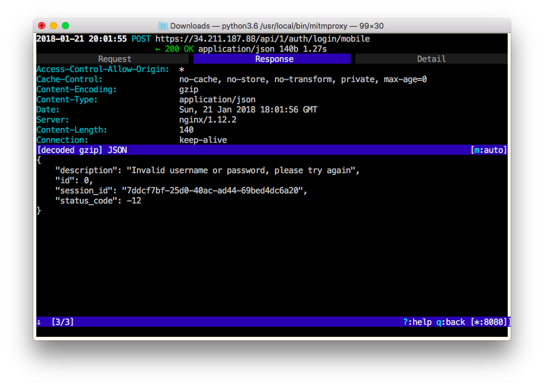

Suppose you have a third-party Android app and want to disable SSL pinning in the app. Just

1. check if automatic tools, designed to disable SSL pinning, do the job;
2. if they don't, reverse the app code and disable SSL pinning yourself, or hire a reverse engineer to do the job for you.

Yes, it's that simple ;) I'd recommend you to start with XPosed framework and JustTrustMe. Here is a quick and not very detailed instruction for your Android device:

1. Root your Android device and install SuperSU. For example, I have an old Lenovo P780 running a stock ROM with Android 4.2.2, so I just used [Framaroot](https://4pda.ru/forum/index.php?showtopic=452337) to root it. However, your device/ROM is probably different than mine, so google out how to root it. Not just the best advice, I know, but the only possible one.
2. Enable installation of third-party apps and install XPosed framework. Again, here is [the right APK for my Lenovo P780](http://repo.xposed.info/module/de.robv.android.xposed.installer). If your device is not Lenovo P780, try to search [repo.xposed.info](http://repo.xposed.info) for the right APK for your phone/ROM, or just google it.
4. Install [JustTrustMe](https://github.com/Fuzion24/JustTrustMe) and enable it in Xposed Installer (run Xposed Installer, go to "Modules" and set the flag for "JustTrustMe"). 
5. Check if your Android device has a system-wide proxy setting in system settings (some ROMs have it). If it doesn't, install [ProxyDroid](https://play.google.com/store/apps/details?id=org.proxydroid) and allow root access for it.

Also install [mitmproxy](http://docs.mitmproxy.org/en/stable/install.html) on your Mac. Then

1. Connect your Mac and Android device to the same WiFi network
2. Run in Mac console

	```
	$ ifconfig | grep "inet "
	```
	
	The output will be similar to
	
	```
	inet 127.0.0.1 netmask 0xff000000
	inet 192.168.0.113 netmask 0xffffff00 broadcast 192.168.0.255
	```
	
	Find the IP of your Mac (in the example above, the IP is `192.168.0.113`).
3. Set the IP and `8080` as HTTP proxy address:port for your Android device. If your ROM supports a system-wide proxy, set the IP and `8080` in system settings, otherwise start ProxyDroid and set it in the app.
4. Run mitmproxy on your Mac. 

Enjoy catching HTTPs traffic... 





Or not. JustTrustMe, as well as any other SSL disabling tool, works for some apps, and does not work for other. You don't know if it works for your until you try it. If you don't see the HTTPs traffic you need, try another tool or consider reversing the app yourself/hiring somebody who can help you with it.