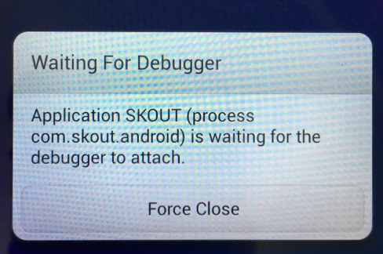

This guide is a part of the series about third-party Android code debugging:

* [Debugging third-party machine code in Android](../2018-01-16-debugging-machine-code-android/)
* [Debugging third-party Android Java code on OS X](../2018-01-20-debugging-thirdparty-android-java-code/)
* Debugging third-party Android app code from the very beginning _(the guide you are reading now)_
* [Debugging Android third-party Java apps with native methods](../2018-01-25-debugging-mixed-android-code/)

In [the previous guide](../2018-01-20-debugging-thirdparty-android-java-code/) about debugging third-party Android Java code, we 

1. run the app we want to debug,
2. and then attach our debugger to the already running app.

Acting in this way, we may miss a lot of interesting things, e.g. `onCreate(...)` method of the main activity. In this section, we consider a trick for debugging Android applications from the very first Dalvik instruction.

For this trick, you need an Android device with a console to run command line utils on the device (you can use `adb shell` or install [SSHDroid](https://play.google.com/store/apps/details?id=berserker.android.apps.sshdroid) and just ssh the device from your Mac). Also, "USB debugging" must be enabled on the device.

**Note!** If the trick does not work for you on a non-rooted Android device, try to root the device and run `am` as root (in `adb shell su` console or in an SSH console as root `#`). If root doesn't help... well, sorry, probably the best solution is to change the device/ROM and try again. ★

The trick itself is very simple. Follow [the guide](../2018-01-20-debugging-thirdparty-android-java-code/) (see the step-by-step instruction in "How to debug APK" section). On step 5, _"...run the app on your Android device..."_, 

1. Kill the app process on the device in the way you prefer, e.g. tap "Settings" ➡ "Applications" ➡ tap the app ➡ "Force stop".
2. Connect your Android device with `adb shell` or SSH and run

	```
	$ am start -W -D <the application package>/<the application activity to start>
	```

	**Note!** You can find the application package by executing in the Android device console:
	
	```
	$ pm list packages
	```
	
	To find the application activity, you can
	
	* run the app by tapping its icon on the Android device, then execute in Android device console:
	
		```
		$ am stack list
		```
		
		it gives you a list of running apps activities. Find the right one and use it with the `am start -W -D` command line.
	* ...or, if `am` on your device doesn't support `stack list` option, just look at the decompiled Dalvik code and recognize the name of the main activity yourself. ★

	For example, the right `am start` command line for [Skout](https://play.google.com/store/apps/details?id=com.skout.android) app is
	
	```
	$ am start -W -D com.skout.android/com.skout.android.activities.Skout
	```
	
	The result should look similar to
	
	
3. Switch to Android Studio, find the main activity class and set breackpoints at

	```
	.method static constructor <clinit>()V
	.method public constructor <init>()V
	.method public onCreate(Landroid/os/Bundle;)V
	```
	
	For the Skout app, it looks like
	
	
	
Then just keep following [the guide](../2018-01-20-debugging-thirdparty-android-java-code/). As soon as you run debugging on the step 6, your breakpoints hit and you can start debugging the app from the very first Dalvik instruction:


In general, the good thing is we don't need to touch (patch/rebuild/resign) APK. The bad thing is the trick may need root to work.