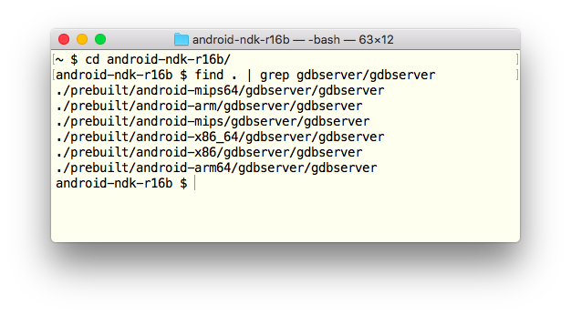
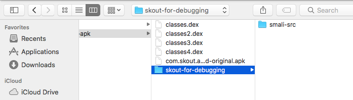
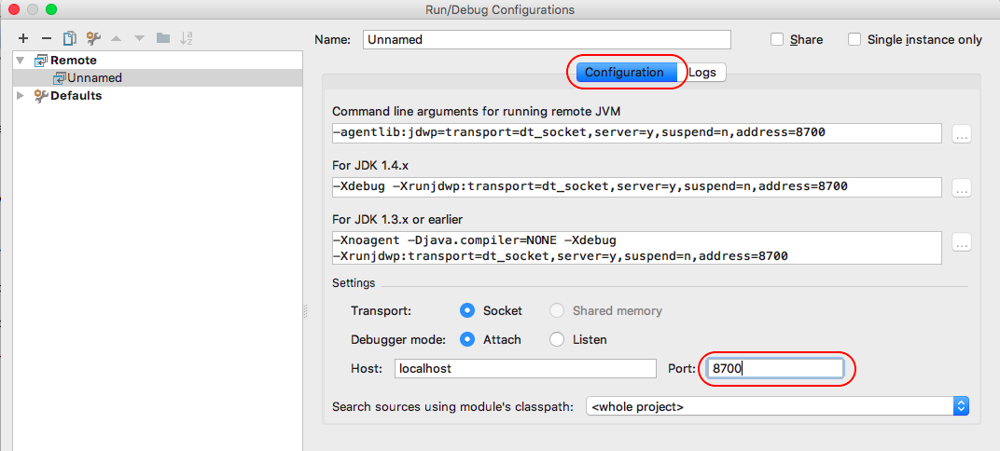
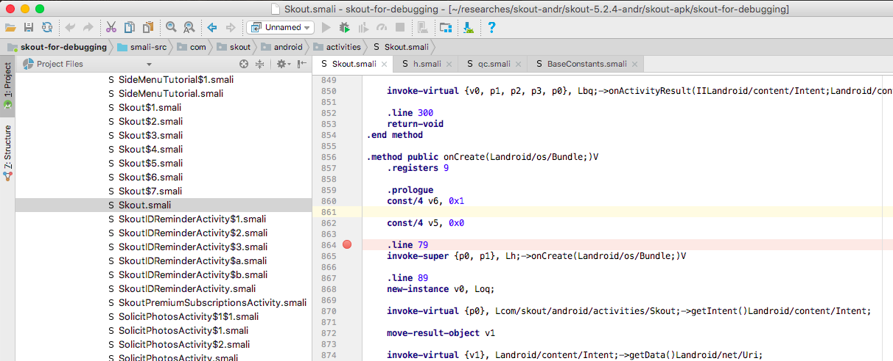
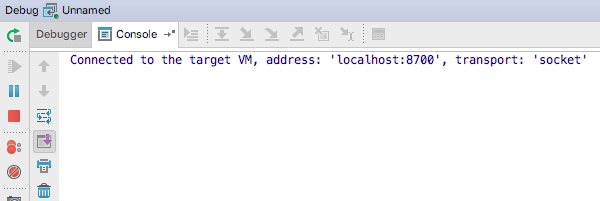

This guide is the last part of the series about third-party Android code debugging:

* [Debugging third-party machine code in Android](../2018-01-16-debugging-machine-code-android/)
* [Debugging third-party Android Java code on OS X](../2018-01-20-debugging-thirdparty-android-java-code/)
* [Debugging third-party Android app code from the very beginning](../2018-01-23-debugging-android-apps-from-first-instruction/)
* Debugging Android third-party Java apps with native methods _(the guide you are reading now)_

# Prerequisites

Check your Android device:

1. The device is rooted.
2. You have access to Android console as root (with `adb shell su` or via SSH with [SSHDroid](https://play.google.com/store/apps/details?id=berserker.android.apps.sshdroid)).
3. SuperSU may be needed to allow `gdbserver` and/or SSHDroid run as root (it depends on the device/ROM).
4. `gdbserver` for the Android device CPU arch is copied to `/data/gdbserver/`. Usually, the proper `gdbserver` for your arch is under

	```
	<Android NDK directory>/prebuilt/android-<Android device CPU arch>/gdbserver/
	```
	
	e.g.
	
	
5. "USB debugging" is enabled

__Note!__ Most probably, you need one more step. Create a dedicated local directory on your Mac and copy `/system/lib` (`/system/lib64` for 64-bit devices) from your Android device to the dedicated directory. In other words, make a local copy of Android `/system/lib` on your Mac. ★

Check your Mac:

1. [Android Studio](https://developer.android.com/studio/index.html) installed.
2. Android SDK Platform Tools installed. To check and install it if needed, go to Android Studio settings ➡ "Appearance & Behavior" ➡ "System Settings" ➡ "Android SDK" ➡ "SDK Tools" ➡ "Android SDK Platform Tools".
3. Android Device Monitor (aka DDMS) works properly. To check it, run 

	```
	$ ~/Library/Android/sdk/tools/monitor
	```
	
	If it does not run or stucks after start, downgrade JDK. To remove the current JDK, exec
	
	```
	$ /usr/libexec/java_home -V
	```
	
	It will print the JDK's home directory, e.g.
	
	```
	Matching Java Virtual Machines (1):
	    9.0.1, x86_64:	"Java SE 9.0.1"	/Library/Java/JavaVirtualMachines/jdk-9.0.1.jdk/Contents/Home
	```
	
	Remove the JDK home directory (e.g. `/Library/Java/JavaVirtualMachines/jdk-9.0.1.jdk/`). If it doesn't help, also remove
	
	```
	$ sudo rm -rf /Library/PreferencePanes/JavaControlPanel.prefPane
	$ sudo rm -rf /Library/Internet\ Plug-Ins/JavaAppletPlugin.plugin
	$ sudo rm -rf /Library/LaunchAgents/com.oracle.java.Java-Updater.plist
	$ sudo rm -rf /Library/PrivilegedHelperTools/com.oracle.java.JavaUpdateHelper
	$ sudo rm -rf /Library/LaunchDaemons/com.oracle.java.Helper-Tool.plist
	$ sudo rm -rf /Library/Preferences/com.oracle.java.Helper-Tool.plist
	```
	
	Old JDKs are in [the Oracle archive](http://www.oracle.com/technetwork/java/javase/archive-139210.html) (Oracle account is needed to download). At the moment, Android Device Monitor works with OS X High Sierra 10.13.2 and JDK 1.8.0\_141, but it may be changed in the future.
4. The latest smalidea archive [downloaded](https://bitbucket.org/JesusFreke/smali/downloads/) and installed to Android Studio according to [the instruction in "Installation" section](https://github.com/JesusFreke/smali/wiki/smalidea).
5. The latest JAR's for smali and baksmali [downloaded](https://bitbucket.org/JesusFreke/smali/downloads/) and placed to any suitable directory.
6. 7zip installed (the simplest was is to install [Homebrew](https://brew.sh) and then run `brew install p7zip` in OS X Terminal).
7. The latest [Android NDK](https://developer.android.com/ndk/index.html) installed
8. Also, you need a disassembler to disassemble/analyse `.so` libraries from your Android device (e.g. my devices have CPUs with Thumb/ARM, ARM64, or x86_64 architecture, so I use [Hopper](https://hopperapp.com) to disassemble `.so` libraries)

__Recommendation!__ Two things to keep it simple:

* Cover smali and baksmali JAR with shell scripts, e.g.

	```
	#!/bin/sh

	# It's a smali.sh
		
	BASEDIR=$(dirname "$0")
	java -jar "$BASEDIR/smali-2.2.2.jar" "$@"
	```
	
	```
	#!/bin/sh

	# It's a baksmali.sh
	
	BASEDIR=$(dirname "$0")
	java -jar "$BASEDIR/baksmali-2.2.2.jar" "$@"
	```
	This allows you to use `backsmali.sh ...` instead of `java -jar path/to/baksmali-2.2.2.jar ...`. In this guide I'll use `backsmali.sh` whatever possible.

* Add to `~/.bash_profile`:

	```
	# Android platform tools
	PATH=$PATH:~/Library/Android/sdk/platform-tools/
	
	# The folder contains smali/baksmali JAR's and cover shell scripts
	PATH=$PATH:~/researches/_tools/smali/
	
	# Android Device Monitor (DDMS)
	PATH=$PATH:~/Library/Android/sdk/tools/

	# Path to gdb
	PATH=$PATH:~/android-ndk-r16b/prebuilt/darwin-x86_64/bin/
	```

No need to explain why this makes your life easier :) ★

## Preparations

The main idea is to use two debuggers side by side:

* Android Studio debugger to debug Smali 
* GDB to debug native code

Consider [Skout](https://play.google.com/store/apps/details?id=com.skout.android) app as an example:

1. Install the app from Google Play to your Android device and get the APK:

	```
	$ adb pull /data/app/com.skout.android-1/base.apk ./
	$ mv base.apk com.skout.android-original.apk
	```
2. Backsmali classes:

	```
	$ mkdir -p skout-for-debugging/smali-src
	$ 7z e com.skout.android-original.apk classes*.dex
	$ for c in classes*.dex; do baksmali.sh d $c -o ./skout-for-debugging/smali-src; done
	```
3. Run Android Studio and choose in the main menu: "File" ➡ "New" ➡ "Import Project". Choose the `skout-for-debugging/` directory created at the previous step:

	
	
	Click "Open". Then choose "Create project from existing sources":
	
	
	
	Click "Next". On the next step, check if the "Project location" path is correct (it must point to your `skout-for-debugging/` directory):
	
	
	
	Click "Next". Wait while Android Studio is inspecting the directory, then make sure that `skout-for-debugging` directory is checked:
	
	
	
	Click "Next". Wait while Android Studio is looking for appropriate frameworks (it will not find any). Get the message
	
	
	
	and click "Finish". Wait while Android Studio is indexing files, then, in the left panel, choose "Project ➡ Project Files":
	
	
	
	Mark the `skout-for-debugging/smali-src/` directory as the sources root:
	
	
4. In the main menu of Android Studio, click "Run" ➡ "Edit Configurations..." ➡ "+" ➡ "Remote":

	
	
	On "Configuration tab", change "Port" to `8700`:
	
	
	
	Click "OK".
5. Connect your Android device to the Mac via USB, open your Android device console (with `adb shell su` or SSHDroid as root `#`). Find the package of your app with `pm list packages`, e.g. for Skout

	```
	$ pm list packages | grep Skout
	```
6. Find the main activity for the app. You can run the app as usual and use `am stack list` command to list activities

	```
	$ am stack list
	```
	If `am` does not support `stack list` option on your device/ROM, look at the decompiled Smali code (for Skout, the code is in `skout-for-debugging/smali-src/`) and find the main activity youself.
7. Kill the app process, e.g. tap "Settings" ➡ "Applications" ➡ tap the app ➡ "Force stop", or use `ps` and `kill` in the Android console.
8. In the Android console, run

	```
	$ am start -W -D <the application package>/<the application activity to start>
	```
	
	E.g. for Skout:
	
	```
	$ am start -W -D com.skout.android/com.skout.android.activities.Skout
	```
	
	The resutl should look similar to
	
	
9. Switch to Android Studio, find the main activity class and set breakpoints at

	```
	.method static constructor <clinit>()V
	.method public constructor <init>()V
	.method public onCreate(Landroid/os/Bundle;)V
	```
	
	For the Skout app, it looks like
	
	

10. Run Device Monitor on the Mac, and select the app on the "Devices" tab:

	

	__Note!__ Keep Android Device Monitor open until you finished debugging the app! Also, the app must be selected in Android Device Monitor while you are debugging the app! ★

11. Switch back to Android Studio. In the main menu, click "Run" ➡ "Debug 'Unnamed'". As result, Android Studio must say 

	> Connected to the target VM, address: 'localhost:8700', transport: 'socket'
	
	in its console:

	
	
	Also, the app must be marked with a green bug icon in Android Device Monitor:
	
	
	
	__Note!__ Alternatively, on step 4, you can specify an individual port instead of `8700`:
	
	
	
	In this case you don't need to keep Android Device Monitor open with the app selected. ★

12. If you have a local copy of Android `/system/lib/` (see the note in the previous section), copy application `.so` libs from the Android device to the same local folder on your Mac (with `adb pull` or, if you use SSH, `scp`). For Skout, the libs are in `/data/data/com.skout.android/lib/`.
	
13. In the Android device console, attach `gdbserver` to the Skout process:

	```
	# gdbserver *:6666 --attach <PID>
	```
	
	where `<PID>` is the pid of the process (find it with `ps | grep Skout`).

14. On the Mac, run `gdb` and execute the commands in GDB console:

	```
	(gdb) target remote <Android device IP>:6666
	(gdb) set solib-search-path path/to/the/local/copy/of/android/system/lib/on/your/Mac/
	(gdb) info sharedlibrary
	(gdb) c
	```
	
	e.g.
	
	
15. Research the Smali code, find native methods declaration and `loadLibrary` calls, e.g. with regular expressions:

	```
	$ cd skout-for-debugging/smali-src/
	$ grep -r . -e '.method[^\n]*native '
	$ grep -r . -e '->loadLibrary'
	```
	
	Breakpoint the `loadLibrary` and native method calls your are interested in.
	
16. Use a disassembler on your Mac to research the native libraries you copied from the Android device to the local folder (see step 12), find the functions implementing the native methods you are interested in. Breakpoint the functions in GDB.

Ready for debugging!

__Note!__ If you do not create a local copy of `/system/lib/` (see the note in the previous subsection), you don't need step 12 and `set solib-search-path ...` GDB command on step 14. However, as result, you may get system/app libraries without any symbols. ★


## How to debug

The debugging is simple:

1. Continue process in GDB console

	```
	(gdb) c
	```
2. Continue process in Android Studio
3. Some breakpoints in the main activity class hit. Now you are able to debug Smali code from the very beginning. You can set breakpoints in Android Studio, trace Dalvik instructions, inspect/change class fields etc:

	
	
	However, you can't see Smali registers `v0, v1, ...` and `p0, p1, ...` in "Variables". To see registers, use "Evaluate expression":
	
	
	
	Even in this case, you're not able to change the registers.
3. Do something to trigger native library loading and/or calling a native method you are interested in. As result, the breakpoint on the native method call in Smali code hits.
5. Continue debugging in Android Studio, so the breakpoint on the corresponding function in native code hits in GDB. Now you can debug the native code with GDB.

__Note!__ Android Studio debugging is frozen while you are debugging native code in GDB. So do not forget to continue executing native code with `(gdb) c` in GDB console. ★

# Links

* [Debug Android native code with gdb](https://packmad.github.io/gdb-android/)
* [Debug Android smali code (without repackaging)](https://packmad.github.io/debug-smali/)
* [Android Reverse Engineering: Debugging Smali in Smalidea](https://crosp.net/blog/android/android-reverse-engineering-debugging-smali-using-smalidea/)