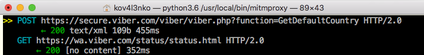
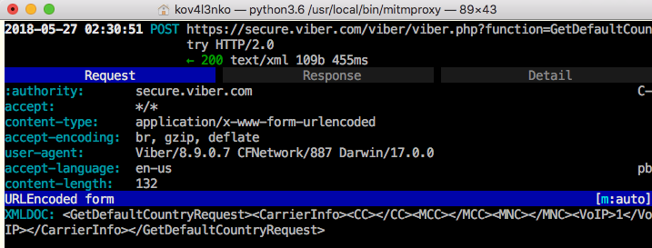
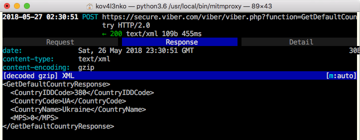

# Motivation

My motivation to start this research was simple. I wanted to see HTTPs traffic of Viber 8.9.0.7 on iOS 11.0.1 with [Electra 1.0.4](https://coolstar.org/electra/). I tried [SSLKillSwitch2](https://github.com/nabla-c0d3/ssl-kill-switch2), but it didn't disable SSL pinning. I have no idea why. Anyway, I did a research and wrote a simple script to disable SSL pinning in Viber by hooking just a single iOS Security framework function [`SecTrustEvaluate(...)`](https://developer.apple.com/documentation/security/1394363-sectrustevaluate?language=objc).

# How `SecTrustEvaluate(...)` works

The function declaration is

```
OSStatus SecTrustEvaluate(SecTrustRef trust, SecTrustResultType *result);
```

Here is the functions arguments according to [Apple official docu](https://developer.apple.com/documentation/security/1394363-sectrustevaluate?language=objc):

* `trust` is a "trust manager object". In fact, it's an ObjC object, containing information about certificates and check rules (policies). The object is usually created by [`SecTrustCreateWithCertificates(...)`](https://developer.apple.com/documentation/security/1401555-sectrustcreatewithcertificates?language=objc).

* `result` is a pointer to `SecTrustResultType` (which is actually `int`).

The function evaluates the trust manager object: extract the certificates and check rules from the object, and check the certificates against the rules. If the check result is ok, the function writes `kSecTrustResultProceed (=1)` to `result` and returns `0` for success.

# How to patch `SecTrustEvaluate(...)`

I wrote a [Frida](https://www.frida.re/) JS script. It patches `SecTrustEvaluate(...)`. As result, the patched function

* always writes `kSecTrustResultProceed (=1)` to `result`;
* always returns `0`.

The script code:

```
/*
	****************************************
	 killSSL.js Frida script
	 by Dima Kovalenko
	****************************************
	
	Usage:
		
		1. Run Viber on the device
		
		2. Inject the script to the process:
			$ frida -U -n Viber  -l path/to/killSSL.js
		
		3. SSL pinning in Viber HTTPs is
		   disabled. Now you can intercept
		   Viber HTTPs requests, e.g. with
		   mitmproxy.
*/


// Are we debugging it?
DEBUG = true;

function main() {
		
	// Get SecTrustEvaluate address
	var SecTrustEvaluate_prt = Module.findExportByName("Security", "SecTrustEvaluate");
	if (SecTrustEvaluate_prt == null) {
		console.log("[!] Security!SecTrustEvaluate(...) not found!");
		return;
	}
		
	// Create native function wrappers for SecTrustEvaluate
	var SecTrustEvaluate = new NativeFunction(SecTrustEvaluate_prt, "int", ["pointer", "pointer"]);
	
	// Hook SecTrustEvaluate
	Interceptor.replace(SecTrustEvaluate_prt, new NativeCallback(function(trust, result) {
		// Show "hit!" message if we are in debugging mode
		if (DEBUG) console.log("[*] SecTrustEvaluate(...) hit!");
		// Call original function
		var osstatus = SecTrustEvaluate(trust, result);
		// Change the result to kSecTrustResultProceed
		Memory.writeU8(result, 1);
		// Return errSecSuccess
		return 0;
	}, "int", ["pointer", "pointer"]));
	// It's done!
	console.log("[*] SecTrustEvaluate(...) hooked. SSL should be pinning disabled.");	
}

// Run the script
main();
```

The result (some examples):







# Does it work for Viber only?

I tested the script on iPhone 5s running iOS 11.0.1 with Electra 1.0.4. It worked for

* Viber 8.9.0.7
* Safari

It didn't work for AppStore. I did not test it with other versions of Viber or iOS, with other apps, or on other devices. So I'm not sure it will work for you. 

---

__WARNING!__ If you wanna try to use the script, do it on your own risk. Stable and safe work of the script is not guaranteed.

---

Happy reversing! :)