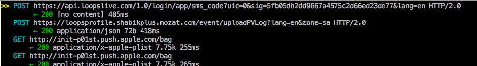
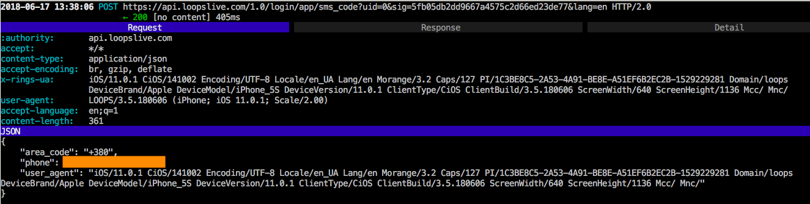

I continue to play with SSL pinning on iOS. This time is was [AFNetworking](https://github.com/AFNetworking/AFNetworking) framework.

Today a random guy from Twitter asked me to disable SSL on the [Loops](https://itunes.apple.com/sa/app/loops-your-live-playground/id1085411495?mt=8) app for Android and iOS. From time to time I do quick researches for free, so why not?

It is well known that the "key function" of SSL pinning protection in AFNetworking is the method

```
-[AFSecurityPolicy evaluateServerTrust:forDomain:]
```
declared as

```
- (BOOL)evaluateServerTrust:(SecTrustRef)serverTrust forDomain:(nullable NSString *)domain;
```

It returns `1` if domain is safe, and `0` otherwise. So, the easiest way to crack SSL pinning here is to hook the method and replace the result with `1`. I wrote a simple Frida script:

```
/*

	**********************************************
	 disable_ssl_pinning_in_loops.js Frida script
	 by Dima Kovalenko
	**********************************************
	
	Usage:
		
		1. Run Loops on the device
		
		2. Inject the script to the process:
			$ frida -U -n LOOPS  -l disable_ssl_pinning_in_loops.js
		
		3. SSL pinning in Loops HTTPs is
		   disabled. Now you can intercept
		   Loops HTTPs requests, e.g. with
		   mitmproxy.
		   
		IMPORTANT NOTE: Use an HTTP(s) sniffer with HTTP 2.0 support!

*/

function main() {
	var resolver = new ApiResolver('objc');
	var matches = resolver.enumerateMatchesSync("-[AFSecurityPolicy evaluateServerTrust:forDomain:]");
	if (matches.lenght == 0) {
		console.log("\n[E] -[AFSecurityPolicy evaluateServerTrust:forDomain:] is not found!\n");
		return;
	}
	Interceptor.attach(
		ptr(matches[0]["address"]),
		{
			onLeave: function(retval) {
				console.log("[I] -[AFSecurityPolicy evaluateServerTrust:forDomain:] hits!");
				retval.replace(1);
			}
		}
	);
	console.log("[I] -[AFSecurityPolicy evaluateServerTrust:forDomain:] is hooked!\n")
}

main();
```

The script was tested with iPhone 5s running iOS 11.0.1 with Electra 1.0.4. As result, I saw HTTP(s) traffic of the Loops app:





The research and the script creation took 30 min.

So it goes.