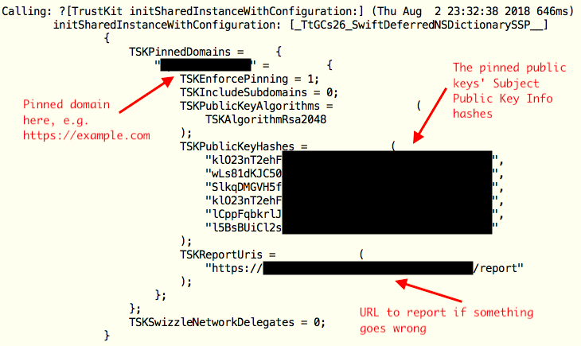
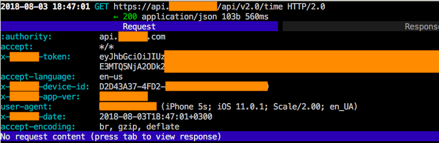

This is a blog post about disabling SSL pinning... yes, again! :) About two weeks ago I researched an iOS application. The application used [TrustKit](https://github.com/datatheorem/TrustKit) from [DataTheorem](https://www.datatheorem.com) to implement SSL pinning. My goal was to bypass the protection and intercept the traffic. Here is a quick research.

---

**Note!** The research was a part of a bug bounty program. According to the bug bounty NDA, I can't share the application name, so I removed any application-related details from screenshots. Thanks for your understanding. 

---

After digging [the TrustKit sources on GitHub](https://github.com/datatheorem/TrustKit), I found two relatively simple tricks to bypass TrustKit. First one looked barely legal. The application initialized TrustKit as follows:



According to the [TrustKit documentation](https://github.com/datatheorem/TrustKit/blob/master/docs/getting-started.md#always-start-with-pinning-enforcement-disabled), it was enough to hook

```
+[TrustKit initSharedInstanceWithConfiguration:]
``` 

and set `TKSEnforcePinning` to zero at the method entry point. It might work, but it needed to get a mutable copy of the `NSDictionary` with the settings, then to get all nested dictionaries and their mutable copies, then to alternate them all, then to assemble all that crap back into a "fixed" immutable setting dictionary... it was too much coding for a lazy guy like me :)

So I found another way. I just replaced

```
// See https://github.com/datatheorem/TrustKit/blob/master/TrustKit/Pinning/ssl_pin_verifier.m 
// for details
TSKTrustEvaluationResult verifyPublicKeyPin(
	SecTrustRef serverTrust, 
	NSString *serverHostname, 
	NSSet<NSData *> *knownPins, 
	TSKSPKIHashCache *hashCache
)
```

with a dummy function in runtime. It always return `TSKTrustEvaluationSuccess` (`=0`). It was easy. Here is the Frida script:

```
/*
	
	This is bypass_trustkit.js. To start the script, run
	$ frida -U -f the.app.bundle.Name --no-pause -l bypass_trustkit.js
	
*/

function main() {
		
	// Get verifyPublicKeyPin address
	var symbols = Module.enumerateSymbolsSync("TrustKit");
	var verifyPublicKeyPin_prt = null;
	for (var i = 0; i < symbols.length; i++) {
		if (symbols[i]["name"] === "verifyPublicKeyPin") {
			verifyPublicKeyPin_prt = symbols[i]["address"];
			break;
		}
	}

	// Did we find verifyPublicKeyPin?
	if (verifyPublicKeyPin_prt == null) {
		console.log("[!] TrustKit!verifyPublicKeyPin(...) not found!");
		return;
	}
		
	// Hook verifyPublicKeyPin
	Interceptor.replace(
		verifyPublicKeyPin_prt, 
		new NativeCallback(function(serverTrust, serverHostname, knownPins, hashCache) {
			return 0; // =TSKTrustEvaluationSuccess
		}, 
	"int", ["pointer", "pointer", "pointer", "pointer"]));

	// It's done!
	console.log("[*] verifyPublicKeyPin(...) hooked. SSL pinning should be disabled now.");	
}

// Run the script
main();
```

It worked for me, I intercepted the traffic:



---

**Warning!** If you wanna use the script, do it on your own risk. Stable and safe work of the script is not guaranteed!

---

So it goes.